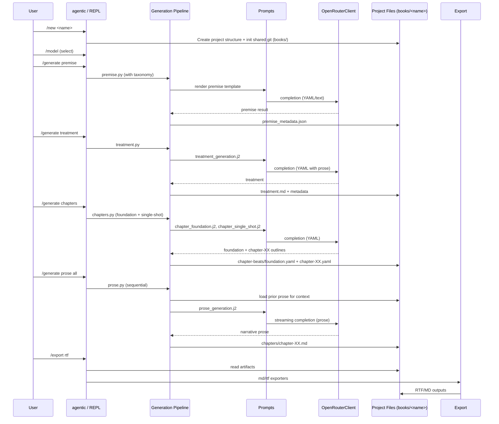
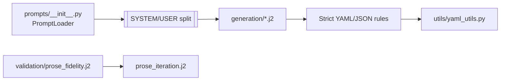
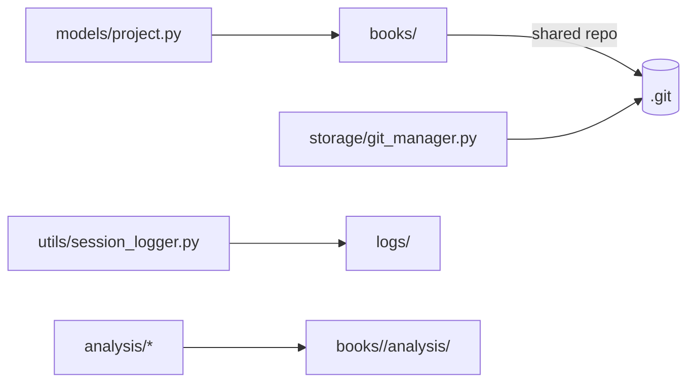

# AgenticAuthor — Diagrammed Architecture Overview (v2)

This document visualizes the core architecture, runtime flow, file hierarchy, and data hand-offs. It is self-contained and aligns with the current source tree and on-disk layout.

## System Context
```mermaid
flowchart LR
  subgraph CLI & UX
    A[agentic (Typer CLI)] --> B[interactive.py (REPL)]
    B --> C[command_completer.py]
    B --> D[model_selector.py]
    B --> E[taxonomy_editor.py]
  end

  subgraph Generation
    G1[premise.py]
    G2[treatment.py]
    G3[chapters.py]
    G4[variants.py]
    G5[judging.py]
    G6[prose.py]
    G7[depth_calculator.py]
    G8[lod_context.py]
    G9[copy_editor.py]
  end

  subgraph Prompts
    P0[prompts/__init__.py\nPromptLoader]
    P1[generation/*.j2]
    P2[editing/*.j2]
    P3[kdp/*.j2]
  end

  subgraph API
    X1[openrouter.py]
    X2[streaming.py]
    X3[models.py]
    X4[auth.py]
  end

  subgraph Storage & Utils
    S1[models/project.py]
    S2[storage/git_manager.py]
    U1[utils/tokens.py]
    U2[utils/yaml_utils.py]
    U3[utils/session_logger.py]
  end

  A --> B
  B -->|/generate ...| G1 & G2 & G3 & G6
  G1 & G2 & G3 & G6 --> P0 --> P1
  G6 --> P2
  G3 --> G4 --> G5
  B -->|LLM calls| X1 --> X2
  X1 --> X3 --> B
  B --> S1
  S1 --> S2
  G1 & G2 & G3 & G6 --> U1 & U2 & U3
```

ASCII fallback:
- CLI → REPL → Generation (premise/treatment/chapters/prose)
- Generation → Prompts (Jinja) → API (OpenRouter) → streaming
- Storage (Project/Git) + Utils (tokens/YAML/logger) support each step

## Runtime Flow (New Book → Export)


## File Hierarchy (key areas)
```mermaid
flowchart TD
  A[repo/] --> B[src/]
  A --> C[books/]
  A --> D[docs/]
  A --> E[taxonomies/]
  A --> F[logs/]

  subgraph src
    B1[cli/]
    B2[api/]
    B3[config/]
    B4[generation/]
    B5[prompts/]
    B6[models/]
    B7[storage/]
    B8[export/]
    B9[utils/]
  end

  subgraph books/<name>
    C1[premise/]
    C2[treatment/]
    C3[chapter-beats/]
    C4[chapter-beats-variants/]
    C5[chapters/]
    C6[analysis/]
    C7[exports/]
    C8[project.yaml]
  end
```

Notes
- `chapter-beats/` holds structured YAML (foundation + per‑chapter outlines). `chapters/` holds prose as Markdown.
- Variants + judging live under `chapter-beats-variants/` and record decisions.

## Data Artifacts & Formats
```mermaid
flowchart LR
  Prem[Premise (JSON)] --> Treat[Treatment (YAML prose)]
  Treat --> Found[Foundation (YAML: metadata/characters/world)]
  Found --> Beats[Chapter Beats (YAML per chapter)]
  Beats --> Prose[Chapter Prose (Markdown per chapter)]
  Prose --> Export[RTF/MD Exports]

  Beats -.-> Analysis[Analysis Reports (MD)]
  Prose -.-> Analysis
```

## Prompt Contracts & Validation


Principles
- Prompts instruct exact formats; validators flag deviations (e.g., summary‑only prose → insufficient_detail).
- Robust YAML parsing falls back gracefully with explicit warnings and debug saves.

## Git & Observability


- Shared Git at `books/` ensures related works share history, while each project remains self‑contained.
- Session logs and analysis reports aid reproducibility and debugging.
```
ASCII fallback
- books/ is a shared Git repo; each project folder contains premise, treatment, chapter‑beats, chapters, analysis, exports.
- session_logger writes prompt/response artifacts and errors to logs and .agentic/debug.
```

## Development Philosophies (recap)
- Full context, fail fast, single model, quality over quotas.
- Global chapter plan; sequential prose with prior prose as authority.
- Deterministic prompt/output contracts; strict parsing; analysis‑driven iteration.
- Disk‑first artifacts with Git traceability.
