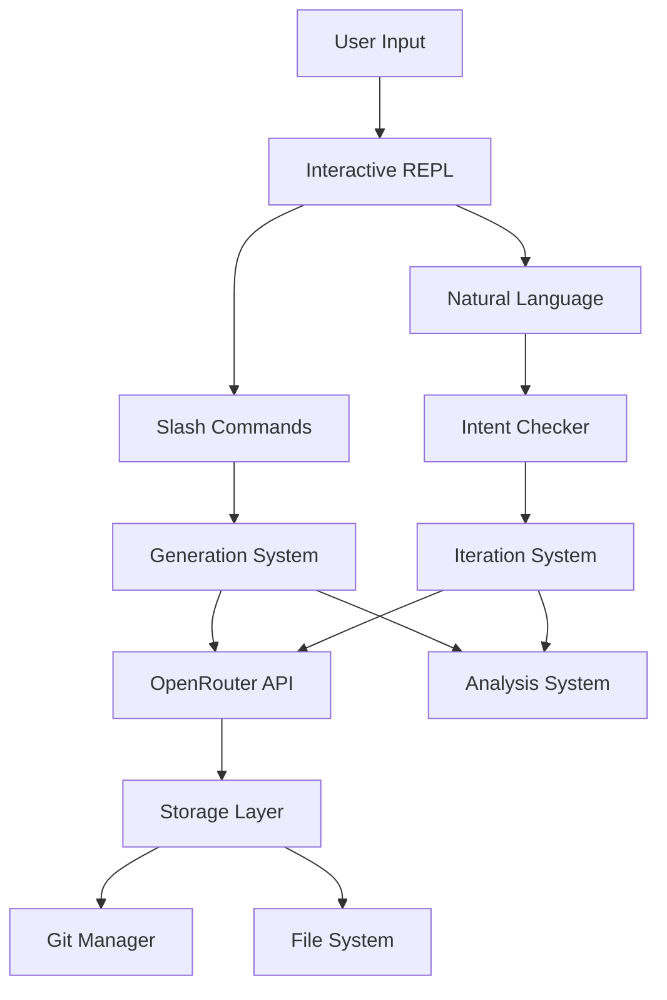

# Architecture Documentation

## System Overview

AgenticAuthor is a Python-based CLI tool for iterative AI-powered book generation using a Level of Detail (LOD) approach.



## Core Components

### 1. CLI Layer (`src/cli/`)
- **main.py**: Entry point, Typer-based CLI
- **interactive.py**: REPL session management
- **command_completer.py**: Slash command auto-completion

**Key Design Decisions:**
- Slash commands (`/`) for explicit actions
- Natural language for iterations
- prompt_toolkit for rich terminal experience

### 2. API Layer (`src/api/`)
- **openrouter.py**: Async client for OpenRouter API
- **streaming.py**: SSE streaming with Rich display
- **models.py**: Model discovery and metadata
- **auth.py**: API key validation

**Key Design Decisions:**
- Async/await for non-blocking operations
- Streaming responses for real-time feedback
- Model caching (1-hour TTL)
- Token usage tracking

### 3. Generation System (`src/generation/`)
- **premise.py**: LOD3 premise generation
- **treatment.py**: LOD2 story treatment
- **chapters.py**: LOD2 chapter outlines
- **prose.py**: LOD0 full prose
- **iteration.py**: Natural language feedback processing
- **analysis.py**: Story quality analysis

**Key Design Decisions:**
- Level of Detail (LOD) approach
- Temperature varies by generation type
- Intent checking (>0.8 confidence threshold)

### 4. Storage Layer (`src/storage/`)
- **git_manager.py**: Git operations via subprocess
- **project.py**: Project file management
- **filesystem.py**: File I/O operations

**Key Design Decisions:**
- Every book is a git repository
- Auto-commit on every change
- Human-readable formats (Markdown/YAML)

### 5. Data Models (`src/models/`)
- **project.py**: Project metadata and structure
- **story.py**: Story content hierarchy
- **taxonomy.py**: Genre-specific elements

**Key Design Decisions:**
- Pydantic for validation
- Separation of metadata and content
- Support for custom taxonomies

## Data Flow

### Generation Flow
1. User issues `/generate` command
2. System determines generation type
3. Appropriate prompt template loaded (Jinja2)
4. API call with type-specific temperature
5. Response streamed to display (SSE parsing)
6. Content saved to appropriate file
7. Git commit created automatically

#### Token Calculation
Dynamic token calculation based on context window:
- Safety buffer: `max(input_tokens * 0.2, 2000)`
- Prevents context overflow
- Adjusts per model capabilities

### Iteration Flow
1. User types natural language feedback
2. Intent checker analyzes request (single LLM call)
3. High confidence (>0.8): Execute directly
4. Medium confidence: Ask for clarification
5. Low confidence (<0.5): Suggest alternatives
6. Changes applied and committed

### Analysis Flow
1. User requests `/analyze [type]`
2. System loads current story content
3. Analysis prompt constructed with content
4. LLM evaluates based on type:
   - Commercial viability (0-100%)
   - Plot holes with severity
   - Character consistency
   - World-building coherence
5. Results saved to `analysis/` directory
6. Git SHA recorded for reproducibility

## File Structure

```
AgenticAuthor/
├── src/
│   ├── cli/              # User interface
│   ├── api/              # External APIs
│   ├── generation/       # Content generation
│   ├── models/           # Data structures
│   ├── storage/          # Persistence
│   └── config/           # Configuration
├── books/                # Generated books
├── taxonomies/           # Genre definitions
├── docs/                 # Documentation
└── tests/                # Test suite
```

## Technology Stack

- **Python 3.11+**: Modern async features
- **prompt_toolkit**: Interactive REPL
- **Rich**: Beautiful terminal output
- **Pydantic**: Data validation
- **aiohttp**: Async HTTP client
- **PyYAML**: Configuration files
- **GitPython**: Version control (via subprocess)

## Design Principles

1. **Natural Language First**: Primary interface is conversational
2. **Version Everything**: Git commits for every change
3. **Progressive Refinement**: LOD approach from outline to prose
4. **Fail Gracefully**: Intent checking prevents misunderstandings
5. **Human-Readable**: All storage in Markdown/YAML

## Security Considerations

- API keys validated for correct format
- Environment variables for sensitive data
- `.env` files excluded from git
- No credentials in code or logs

## Performance Considerations

- Async operations for API calls
- Streaming responses for immediate feedback
- Model metadata cached for 1 hour
- Token usage tracked for cost management

## Future Architecture Considerations

- Plugin system for custom generators
- Multi-model orchestration
- Real-time collaboration support
- Cloud storage integration