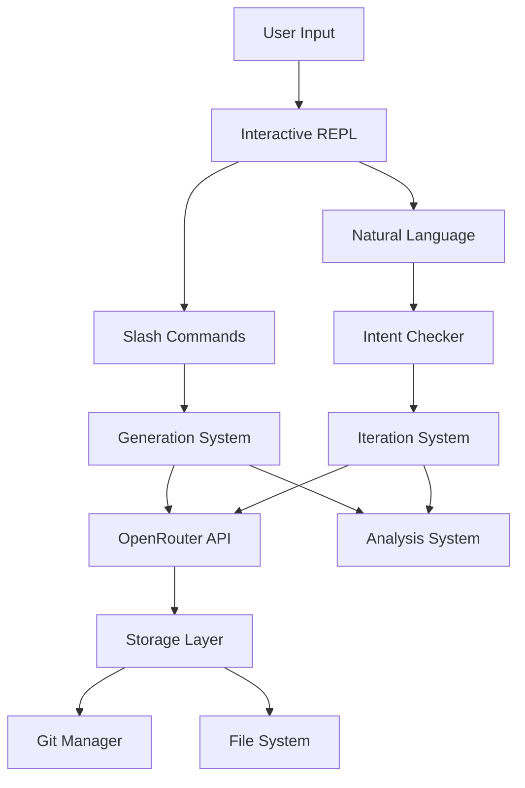

# Developer Guide


## Setup

### Prerequisites
- Python 3.11 or higher
- Git
- OpenRouter API key

### Installation

1. Clone the repository:
```bash
git clone <repository-url>
cd AgenticAuthor
```

2. Create virtual environment:
```bash
python -m venv venv
source venv/bin/activate  # On Windows: venv\Scripts\activate
```

3. Install in development mode:
```bash
pip install -e ".[dev]"
```

4. Set up environment:
```bash
cp .env.example .env
# Edit .env and add your OpenRouter API key
```

## Development Workflow

### Running the Application

```bash
# Start REPL (main interface)
agentic

# With specific project
agentic my-book

# Create new project
agentic new fantasy-novel

# List projects
agentic list
```

### Running Tests

```bash
# Run all tests
pytest

# Run with coverage (HTML report in tests/htmlcov/)
pytest --cov=src --cov-report=term-missing --cov-report=html

# Run coverage with convenience script
python tests/run_coverage.py

# View coverage report
python -m webbrowser tests/htmlcov/index.html

# Run specific test file
pytest tests/unit/test_models.py

# Run specific test
pytest tests/unit/test_models.py::TestProject::test_create_project

# Run with verbose output
pytest -v

# Run async tests
pytest -k async
```

**Note:** Coverage reports are generated in `tests/htmlcov/` to keep the project root clean.

### Code Quality

```bash
# Format code with black
black src/ tests/

# Lint with ruff
ruff src/ tests/

# Type checking with mypy
mypy src/
```

## Code Style

### Python Style
- Follow PEP 8
- Use type hints for all functions
- Docstrings for all public methods
- Line length: 100 characters

### Imports
```python
# Standard library
import os
from pathlib import Path

# Third party
import pytest
from pydantic import BaseModel

# Local
from src.models import Project
from src.api import OpenRouterClient
```

### Async/Await
```python
async def process_content(self, text: str) -> str:
    """Process content with API.

    Args:
        text: Input text to process

    Returns:
        Processed text
    """
    async with self.client as session:
        result = await session.completion(text)
        return result
```

### Error Handling
```python
try:
    result = await api_call()
except aiohttp.ClientError as e:
    console.print(f"[red]API Error: {e}[/red]")
    raise
except ValueError as e:
    console.print(f"[yellow]Invalid input: {e}[/yellow]")
    return None
```

## Project Structure

### Adding New Features

1. **New Command**: Add to `src/cli/interactive.py`
```python
# In __init__, add to self.commands
self.commands = {
    # ...
    'mycommand': self.my_command,
}

# Add command handler
def my_command(self, args: str = ""):
    """Handle my command."""
    # Implementation
```

2. **New Generator**: Create in `src/generation/`
```python
# src/generation/my_generator.py
from src.api import OpenRouterClient

class MyGenerator:
    async def generate(self, context: str) -> str:
        # Implementation
```

3. **New Model**: Add to `src/models/`
```python
# src/models/my_model.py
from pydantic import BaseModel

class MyModel(BaseModel):
    field: str
    # Implementation
```

## Testing Guidelines

### Test Structure
```python
class TestFeature:
    """Test feature functionality."""

    def test_basic_case(self):
        """Test the basic use case."""
        # Arrange
        data = create_test_data()

        # Act
        result = process(data)

        # Assert
        assert result.success

    @pytest.mark.asyncio
    async def test_async_operation(self):
        """Test async operations."""
        result = await async_function()
        assert result is not None
```

### Fixtures
```python
@pytest.fixture
def test_project(tmp_path):
    """Create a test project."""
    project = Project.create(
        tmp_path / "test",
        name="Test"
    )
    return project
```

### Mocking
```python
from unittest.mock import Mock, patch

def test_with_mock():
    with patch('src.api.OpenRouterClient') as mock_client:
        mock_client.completion.return_value = "Test response"
        # Test code
```

## Common Tasks

### Adding a Slash Command

1. Update `src/cli/command_completer.py`:
```python
def create_command_descriptions():
    return {
        # ...
        'mycommand': {
            'description': 'Does something',
            'usage': '/mycommand [args]'
        }
    }
```

2. Add handler in `src/cli/interactive.py`
3. Update help text
4. Add tests

### Adding Generation Type

1. Create generator in `src/generation/`
2. Add temperature setting in `constants.py`
3. Add to `/generate` command handler
4. Create tests

### Updating Documentation

When making changes, update:
1. `docs/CHANGELOG.md` - Mark features complete and track changes
2. `docs/USER_GUIDE.md` - Add new user-facing commands/features
3. `docs/DEVELOPER_GUIDE.md` - Update technical documentation
4. `README.md` - Update if major user-facing changes

## Debugging

### Enable Verbose Logging
```python
# In .env
VERBOSE=true
```

### Debug REPL Issues
```python
# Test without prompt_toolkit
from src.cli.interactive import InteractiveSession
from unittest.mock import Mock

session = InteractiveSession()
session.session = Mock()  # Mock prompt session
# Debug session methods
```

### Debug API Calls
```python
# Enable request logging
import logging
logging.basicConfig(level=logging.DEBUG)
```

## Release Process

1. Update version in `pyproject.toml`
2. Update `CHANGELOG.md` with version notes
3. Run full test suite
4. Create git tag: `git tag v1.0.0`
5. Push tags: `git push --tags`

## Troubleshooting

### Common Issues

**Import Errors**
- Ensure package installed: `pip install -e .`
- Check Python version: `python --version`

**API Key Issues**
- Verify format: Must start with `sk-or-`
- Check .env file location
- Ensure .env not committed to git

**Terminal Issues**
- On Windows, use Windows Terminal or ConEmu
- For tests, mock prompt_toolkit components

**Git Issues**
- Ensure git installed: `git --version`
- Check git config: `git config --list`

## Resources

- [OpenRouter API Docs](https://openrouter.ai/docs)
- [prompt_toolkit Documentation](https://python-prompt-toolkit.readthedocs.io/)
- [Rich Documentation](https://rich.readthedocs.io/)
- [Pydantic Documentation](https://pydantic-docs.helpmanual.io/)

# Architecture

## System Overview

AgenticAuthor is a Python-based CLI tool for iterative AI-powered book generation using a Level of Detail (LOD) approach.



## Core Components

### 1. CLI Layer (`src/cli/`)
- **main.py**: Entry point, Typer-based CLI
- **interactive.py**: REPL session management
- **command_completer.py**: Slash command auto-completion

**Key Design Decisions:**
- Slash commands (`/`) for explicit actions
- Natural language for iterations
- prompt_toolkit for rich terminal experience

### 2. API Layer (`src/api/`)
- **openrouter.py**: Async client for OpenRouter API
- **streaming.py**: SSE streaming with Rich display
- **models.py**: Model discovery and metadata
- **auth.py**: API key validation

**Key Design Decisions:**
- Async/await for non-blocking operations
- Streaming responses for real-time feedback
- Model caching (1-hour TTL)
- Token usage tracking

### 3. Generation System (`src/generation/`)
- **premise.py**: LOD3 premise generation
- **treatment.py**: LOD2 story treatment
- **chapters.py**: LOD2 chapter outlines
- **prose.py**: LOD0 full prose
- **iteration.py**: Natural language feedback processing
- **analysis.py**: Story quality analysis

**Key Design Decisions:**
- Level of Detail (LOD) approach
- Temperature varies by generation type
- Intent checking (>0.8 confidence threshold)

### 4. Storage Layer (`src/storage/`)
- **git_manager.py**: Git operations via subprocess
- **project.py**: Project file management
- **filesystem.py**: File I/O operations

**Key Design Decisions:**
- Every book is a git repository
- Auto-commit on every change
- Human-readable formats (Markdown/YAML)

### 5. Data Models (`src/models/`)
- **project.py**: Project metadata and structure
- **story.py**: Story content hierarchy
- **taxonomy.py**: Genre-specific elements

**Key Design Decisions:**
- Pydantic for validation
- Separation of metadata and content
- Support for custom taxonomies

## Data Flow

### Generation Flow
1. User issues `/generate` command
2. System determines generation type
3. Appropriate prompt template loaded (Jinja2)
4. API call with type-specific temperature
5. Response streamed to display (SSE parsing)
6. Content saved to appropriate file
7. Git commit created automatically

#### Token Calculation
Dynamic token calculation based on context window:
- Safety buffer: `max(input_tokens * 0.2, 2000)`
- Prevents context overflow
- Adjusts per model capabilities

### Iteration Flow
1. User types natural language feedback
2. Intent checker analyzes request (single LLM call)
3. High confidence (>0.8): Execute directly
4. Medium confidence: Ask for clarification
5. Low confidence (<0.5): Suggest alternatives
6. Changes applied and committed

### Analysis Flow
1. User requests `/analyze [type]`
2. System loads current story content
3. Analysis prompt constructed with content
4. LLM evaluates based on type:
   - Commercial viability (0-100%)
   - Plot holes with severity
   - Character consistency
   - World-building coherence
5. Results saved to `analysis/` directory
6. Git SHA recorded for reproducibility

## File Structure

```
AgenticAuthor/
├── src/
│   ├── cli/              # User interface
│   ├── api/              # External APIs
│   ├── generation/       # Content generation
│   ├── models/           # Data structures
│   ├── storage/          # Persistence
│   └── config/           # Configuration
├── books/                # Generated books
├── taxonomies/           # Genre definitions
├── docs/                 # Documentation
└── tests/                # Test suite
```

## Technology Stack

- **Python 3.11+**: Modern async features
- **prompt_toolkit**: Interactive REPL
- **Rich**: Beautiful terminal output
- **Pydantic**: Data validation
- **aiohttp**: Async HTTP client
- **PyYAML**: Configuration files
- **GitPython**: Version control (via subprocess)

## Design Principles

1. **Natural Language First**: Primary interface is conversational
2. **Version Everything**: Git commits for every change
3. **Progressive Refinement**: LOD approach from outline to prose
4. **Fail Gracefully**: Intent checking prevents misunderstandings
5. **Human-Readable**: All storage in Markdown/YAML

## Security Considerations

- API keys validated for correct format
- Environment variables for sensitive data
- `.env` files excluded from git
- No credentials in code or logs

## Performance Considerations

- Async operations for API calls
- Streaming responses for immediate feedback
- Model metadata cached for 1 hour
- Token usage tracked for cost management

## Future Architecture Considerations

- Plugin system for custom generators
- Multi-model orchestration
- Real-time collaboration support
- Cloud storage integration

# Implementation Patterns


## Generation System Implementation

### Prompt Templates (Jinja2)

#### Premise Generation Template
```jinja2
Generate a compelling fiction premise for the {{ genre }} genre.


Build upon this concept: {{ user_input }}


REQUIREMENTS:
1. 2-3 sentences that capture the core conflict
2. Clear protagonist and stakes
3. Unique hook that sets it apart

TAXONOMY SELECTIONS (choose relevant):
{{ taxonomy | format_options }}

Return as JSON:
{
    "premise": "...",
    "taxonomySelections": {...}
}
```

#### Treatment Generation Template
```jinja2
Based on this premise:
{{ premise }}

Generate a detailed story treatment that:
1. Expands the world and characters
2. Outlines the three-act structure
3. Maintains the core premise essence
4. Target length: {{ target_words }} words

Include:
- Act breakdowns
- Major plot points
- Character arcs
- Thematic elements
```

### Token Management

#### Dynamic Token Calculation
```python
def calculate_max_tokens(model_id: str, input_tokens: int) -> int:
    """
    Dynamic token calculation based on context window.

    Formula: context_limit - input_tokens - safety_buffer
    Safety buffer: max(input_tokens * 0.2, 2000)
    """
    model_context = get_model_context_limit(model_id)
    safety_buffer = max(input_tokens * 0.2, 2000)
    return model_context - input_tokens - safety_buffer
```

### Error Recovery Patterns

#### Exponential Backoff for API Calls
```python
async def api_call_with_retry(func, max_retries=3):
    """Retry with exponential backoff: [1, 2, 4, 8] seconds."""
    delays = [1, 2, 4, 8]

    for attempt in range(max_retries):
        try:
            return await func()
        except APIError as e:
            if not e.retryable or attempt == max_retries - 1:
                raise

            delay = delays[min(attempt, len(delays) - 1)]
            await asyncio.sleep(delay)

    raise APIError("Max retries exceeded")
```

#### SSE Stream Parsing
```python
async def parse_sse_stream(response):
    """Parse Server-Sent Events stream from OpenRouter."""
    content = ""

    async for line in response.content:
        line = line.decode('utf-8').strip()

        if not line or not line.startswith('data: '):
            continue

        if line == 'data: [DONE]':
            break

        try:
            data_str = line[6:]  # Remove 'data: ' prefix
            data = json.loads(data_str)

            # Extract token from delta
            if 'choices' in data and data['choices']:
                choice = data['choices'][0]
                if 'delta' in choice and 'content' in choice['delta']:
                    token = choice['delta']['content']
                    content += token
                    yield token
        except json.JSONDecodeError:
            continue

    return content
```

### Caching Strategy

#### Model List Caching
```python
class ModelCache:
    """Cache model list with 1-hour TTL."""

    def __init__(self, cache_dir: Path):
        self.cache_file = cache_dir / "models.json"
        self.ttl = 3600  # 1 hour in seconds

    def get(self) -> Optional[List[Model]]:
        """Get cached models if fresh."""
        if not self.cache_file.exists():
            return None

        with open(self.cache_file) as f:
            data = json.load(f)

        cached_time = datetime.fromisoformat(data['cached_at'])
        if (datetime.now() - cached_time).total_seconds() > self.ttl:
            return None  # Cache expired

        return [Model(**m) for m in data['models']]

    def set(self, models: List[Model]):
        """Cache model list."""
        data = {
            'cached_at': datetime.now().isoformat(),
            'models': [m.dict() for m in models]
        }

        self.cache_file.parent.mkdir(exist_ok=True)
        with open(self.cache_file, 'w') as f:
            json.dump(data, f)
```

## Model Characteristics

### Detailed Model Profiles

#### Claude Opus 4.1 (`anthropic/claude-opus-4.1`)
- **Context**: 200K tokens
- **Strengths**:
  - Literary prose quality
  - Character psychological depth
  - Nuanced dialogue
  - Complex narrative structures
- **Best For**: Final prose generation, character development
- **Temperature**: 0.7-0.9 for creativity

#### GPT-5 (`openai/gpt-5`)
- **Context**: 128K tokens
- **Strengths**:
  - Logical consistency
  - Structured storytelling
  - Reduced hallucinations
  - Rich metaphors
- **Best For**: Treatment and chapter outlines
- **Temperature**: 0.6-0.7 for balance

#### Claude Sonnet 4 (`anthropic/claude-sonnet-4`)
- **Context**: 200K tokens
- **Strengths**:
  - Natural dialogue
  - Style refinement
  - Character voice consistency
- **Best For**: Dialogue polish, style editing
- **Temperature**: 0.3-0.5 for editing

#### Gemini 2.5 Pro (`google/gemini-2.5-pro`)
- **Context**: 1M tokens
- **Strengths**:
  - Can process entire novels
  - Maintains long-term consistency
  - Cross-reference checking
- **Best For**: Full-book analysis, consistency checks
- **Temperature**: 0.5-0.7

#### Grok 4 Fast (`xai/grok-4-fast`)
- **Context**: 128K tokens
- **Strengths**:
  - Humor and wit
  - Unique voice
  - Pop culture awareness
  - Irreverent tone
- **Best For**: Comedy, satire, contemporary fiction
- **Temperature**: 0.8-0.95 for humor

## Intent Checking Implementation

### Structured JSON Intent Response
```python
async def check_intent(feedback: str, context: dict) -> dict:
    """
    Single LLM call for intent determination.

    Returns structured JSON with confidence scoring.
    """
    prompt = f"""
    Story Context:
    - Current: {context['current_file']}
    - Beats: {context.get('beats', 'N/A')}
    - Stats: {context.get('stats', {})}

    User Feedback: "{feedback}"

    Analyze the user's intent and return JSON:
    {{
        "confidence": 0.0-1.0,  // How certain you are
        "action": "string",      // What to do (if confidence > 0.8)
        "target": "string",      // What to modify
        "description": "string", // Human-readable description
        "clarification": "string", // Question to ask (if confidence <= 0.8)
        "options": []            // Suggested options (if unclear)
    }}
    """

    response = await client.json_completion(
        prompt=prompt,
        temperature=0.1,  # Low temperature for consistency
        max_tokens=500
    )

    return response
```

### Confidence Thresholds
- **High (>0.8)**: Execute immediately
- **Medium (0.5-0.8)**: Ask for confirmation
- **Low (<0.5)**: Request clarification with options

## Testing Strategy

### Integration Test Example
```python
import pytest
from pathlib import Path

@pytest.mark.asyncio
async def test_full_generation_pipeline():
    """Test complete LOD3 → LOD2 → LOD0 generation."""

    # Setup
    project = Project.create(Path("test_book"))
    client = OpenRouterClient()

    # Generate premise
    premise_gen = PremiseGenerator(client)
    premise = await premise_gen.generate(
        user_input="A story about time travel",
        genre="scifi"
    )
    assert premise.text
    assert premise.taxonomy_selections

    # Generate treatment
    treatment_gen = TreatmentGenerator(client)
    treatment = await treatment_gen.generate(
        premise=premise,
        target_words=2000
    )
    word_count = len(treatment.text.split())
    assert 1500 < word_count < 2500

    # Generate chapter outlines
    chapter_gen = ChapterGenerator(client)
    outline = await chapter_gen.generate(
        treatment=treatment,
        chapter_count=None  # Auto-calculate
    )
    assert len(outline.chapters) > 0

    # Generate prose for first chapter
    prose_gen = ProseGenerator(client)
    chapter_1 = await prose_gen.generate_chapter(
        chapter_beats=outline.chapters[0].beats,
        chapter_num=1,
        treatment=treatment
    )
    assert len(chapter_1.split()) > 1000

    # Verify git commits
    git = GitManager(project.path)
    log = git.log(limit=4)
    assert "Generate premise" in log
    assert "Generate treatment" in log
```

### Mock API Response for Testing
```python
def mock_streaming_response():
    """Generate mock SSE stream for testing."""
    responses = [
        'data: {"choices": [{"delta": {"content": "Once "}}]}',
        'data: {"choices": [{"delta": {"content": "upon "}}]}',
        'data: {"choices": [{"delta": {"content": "a "}}]}',
        'data: {"choices": [{"delta": {"content": "time"}}]}',
        'data: [DONE]'
    ]

    for response in responses:
        yield response.encode('utf-8') + b'\n'
```

## Performance Optimization

### Parallel Chapter Generation
```python
async def generate_chapters_parallel(outline, treatment):
    """Generate independent chapters concurrently."""
    tasks = []

    for chapter in outline.chapters:
        if chapter.is_independent:  # No dependency on previous chapters
            task = generate_chapter(chapter, treatment)
            tasks.append(task)

    results = await asyncio.gather(*tasks)
    return dict(zip(range(len(results)), results))
```

### Token Usage Tracking
```python
class TokenTracker:
    """Track token usage and costs across requests."""

    def __init__(self):
        self.usage = defaultdict(lambda: {'tokens': 0, 'cost': 0})

    def track(self, model: str, prompt_tokens: int, completion_tokens: int):
        """Update usage statistics."""
        cost = calculate_cost(model, prompt_tokens, completion_tokens)

        self.usage[model]['tokens'] += prompt_tokens + completion_tokens
        self.usage[model]['cost'] += cost

        self.usage['total']['tokens'] += prompt_tokens + completion_tokens
        self.usage['total']['cost'] += cost

    def get_summary(self) -> dict:
        """Get usage summary."""
        return dict(self.usage)
```

## Git Commit Message Formats

### Standard Formats
```
Generate premise: [brief description]
Generate treatment from premise (2500 words)
Generate chapter outlines (12 chapters)
Generate chapter 3 prose: The Confrontation
Iterate treatment: make villain more sympathetic
Iterate chapter 5: add dialogue to confrontation
Polish chapter 7: grammar and pacing
Analyze: commercial viability at abc123d
Export: markdown format
Rollback: revert chapter 5 changes
```

### Automated Message Generation
```python
def generate_commit_message(action: str, target: str, details: dict) -> str:
    """Generate standardized commit message."""

    templates = {
        'generate': "Generate {target}: {description}",
        'iterate': "Iterate {target}: {change}",
        'polish': "Polish {target}: {improvements}",
        'analyze': "Analyze: {analysis_type} at {sha}",
        'export': "Export: {format} format",
        'rollback': "Rollback: {reason}"
    }

    template = templates.get(action, "{action} {target}")
    return template.format(target=target, **details)
```

# Python API Reference


## Python API

### Taxonomy System

```python
from src.generation.taxonomies import (
    TaxonomyLoader,
    PremiseAnalyzer,
    PremiseHistory
)

# Load genre-specific taxonomy
loader = TaxonomyLoader()
taxonomy = loader.load_merged_taxonomy('fantasy')
options = loader.get_category_options(taxonomy)

# Analyze input to determine type
analysis = PremiseAnalyzer.analyze(user_input)
if analysis['is_treatment']:
    # Preserve as treatment, extract taxonomy
    pass
else:
    # Generate or enhance premise
    pass

# Track generation history
history = PremiseHistory()
history.add(premise, genre, selections)
if not history.should_regenerate(new_premise):
    # Avoid repetition
    pass
```

### Premise Generator

```python
from src.generation.premise import PremiseGenerator

generator = PremiseGenerator(client, project, model='x-ai/grok-4-fast')

# Generate with genre and concept
result = await generator.generate(
    genre='fantasy',
    user_input='a world where dreams are currency'
)

# Extract taxonomy from existing treatment
result = await generator.generate_taxonomy_only(
    treatment=existing_text,
    genre='fantasy'
)

# Iterate on existing premise
result = await generator.iterate(
    feedback='Make it darker and more mysterious'
)
```

### OpenRouter Client

```python
from src.api import OpenRouterClient

async with OpenRouterClient(api_key="sk-or-...") as client:
    # Discover available models
    models = await client.discover_models()

    # Simple completion
    response = await client.completion(
        model="anthropic/claude-opus-4.1",
        prompt="Write a story premise",
        temperature=0.9,
        max_tokens=2000
    )

    # Streaming completion
    result = await client.streaming_completion(
        model="anthropic/claude-opus-4.1",
        messages=[
            {"role": "system", "content": "You are a creative writer"},
            {"role": "user", "content": "Write a story"}
        ],
        on_token=lambda token, count: print(token, end=""),
        temperature=0.8
    )

    # JSON completion
    data = await client.json_completion(
        model="anthropic/claude-opus-4.1",
        prompt="Return a JSON object with title and genre",
        temperature=0.3
    )
```

### Project Management

```python
from src.models import Project

# Create new project
project = Project.create(
    path="books/my-story",
    name="My Story",
    genre="fantasy",
    author="John Doe"
)

# Load existing project
project = Project("books/my-story")

# Save content
project.save_premise("A hero's journey begins...")
project.save_treatment("Act 1: The ordinary world...")
project.save_chapter(1, "Chapter 1\n\nIt was a dark night...")

# Load content
premise = project.get_premise()
treatment = project.get_treatment()
chapter = project.get_chapter(1)
```

### Story Model

```python
from src.models import Story, Chapter, ChapterOutline

# Create story structure
story = Story()
story.premise = "A compelling premise"

# Add chapter outline
outline = ChapterOutline(
    number=1,
    title="The Beginning",
    summary="Introduction to the world",
    key_events=["Event 1", "Event 2"],
    word_count_target=3000
)
story.chapter_outlines.append(outline)

# Add full chapter
chapter = Chapter(
    number=1,
    title="Chapter One",
    content="Full prose content...",
    word_count=2847
)
story.add_chapter(chapter)

# Check completeness
if story.is_complete:
    print(f"Total words: {story.total_word_count}")
```

### Git Integration

```python
from src.storage import GitManager

git = GitManager(project_path)

# Initialize repository
git.init()

# Basic operations
git.add()  # Stage all changes
git.commit("Updated chapter 3")
git.status()
git.diff()
git.log(limit=10)

# Auto-commit with descriptive message
git.auto_commit("Generate premise", "Fantasy genre with hero's journey")

# Branch operations
git.create_branch("experiment")
git.checkout("main")
branches = git.list_branches()

# Rollback
git.rollback(steps=1)  # Undo last commit
```

### Configuration

```python
from src.config import get_settings

settings = get_settings()

# Access configuration
api_key = settings.api_key
default_model = settings.default_model
books_dir = settings.books_dir

# Update settings
settings.active_model = "anthropic/claude-opus-4.1"
settings.streaming_output = True
settings.auto_commit = True
```

### Analysis System

```python
from src.generation.analysis import StoryAnalyzer

analyzer = StoryAnalyzer(client, project)

# Commercial viability (0-100%)
commercial = await analyzer.analyze_commercial()
print(f"Market readiness: {commercial.score}%")
print(f"Strengths: {commercial.strengths}")
print(f"Improvements: {commercial.improvements}")

# Plot analysis
plot = await analyzer.analyze_plot()
for hole in plot.holes:
    print(f"Issue: {hole.description} (Severity: {hole.severity})")

# Character consistency
characters = await analyzer.analyze_characters()
for char in characters.profiles:
    print(f"{char.name}: {char.consistency_score}%")
```

### Iteration System

```python
from src.generation.iteration import IterationEngine

engine = IterationEngine(client, project)

# Process natural language feedback
result = await engine.process_feedback(
    "Make the ending more dramatic with a twist"
)

if result.confidence > 0.8:
    # High confidence - execute
    await engine.apply_changes(result.changes)
elif result.confidence > 0.5:
    # Medium confidence - confirm
    if await engine.confirm_intent(result):
        await engine.apply_changes(result.changes)
else:
    # Low confidence - clarify
    options = await engine.get_clarification_options(result)
```

### Custom Generators

```python
from src.generation.base import BaseGenerator

class CustomGenerator(BaseGenerator):
    """Create custom generation types."""

    async def generate(self, context: dict) -> str:
        prompt = self.build_prompt(context)
        response = await self.client.completion(
            model=self.model,
            prompt=prompt,
            temperature=self.temperature
        )
        return self.process_response(response)
```
