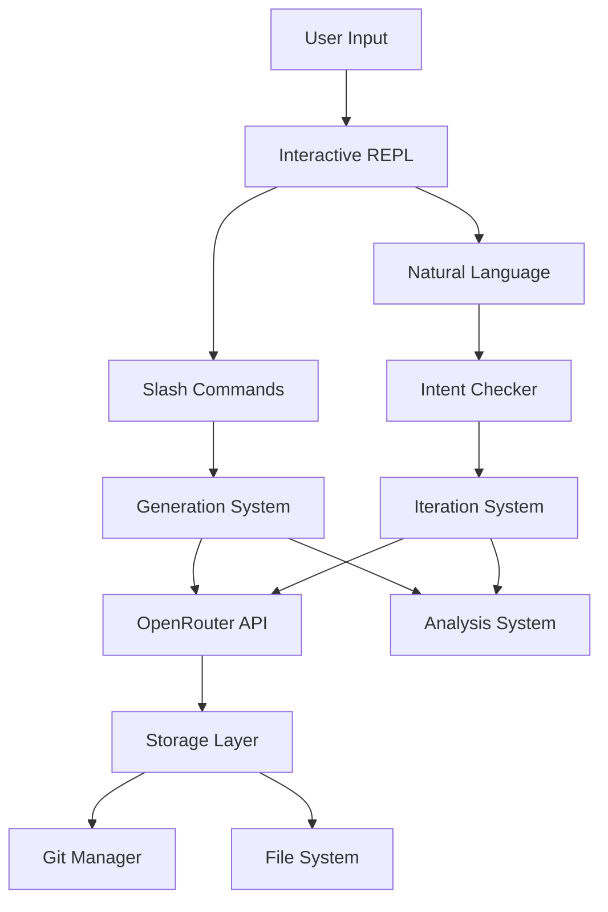

# Developer Guide


## Setup

### Prerequisites
- Python 3.11 or higher
- Git
- OpenRouter API key

### Installation

1. Clone the repository:
```bash
git clone <repository-url>
cd AgenticAuthor
```

2. Create virtual environment:
```bash
python -m venv venv
source venv/bin/activate  # On Windows: venv\Scripts\activate
```

3. Install in development mode:
```bash
pip install -e ".[dev]"
```

4. Set up environment:
```bash
cp .env.example .env
# Edit .env and add your OpenRouter API key
```

## Development Workflow

### Running the Application

```bash
# Start REPL (main interface)
agentic

# With specific project
agentic my-book

# Create new project
agentic new fantasy-novel

# List projects
agentic list
```

### Running Tests

```bash
# Run all tests
pytest

# Run with coverage (HTML report in tests/htmlcov/)
pytest --cov=src --cov-report=term-missing --cov-report=html

# Run coverage with convenience script
python tests/run_coverage.py

# View coverage report
python -m webbrowser tests/htmlcov/index.html

# Run specific test file
pytest tests/unit/test_models.py

# Run specific test
pytest tests/unit/test_models.py::TestProject::test_create_project

# Run with verbose output
pytest -v

# Run async tests
pytest -k async
```

**Note:** Coverage reports are generated in `tests/htmlcov/` to keep the project root clean.

### Code Quality

```bash
# Format code with black
black src/ tests/

# Lint with ruff
ruff src/ tests/

# Type checking with mypy
mypy src/
```

## Code Style

### Python Style
- Follow PEP 8
- Use type hints for all functions
- Docstrings for all public methods
- Line length: 100 characters

### Imports
```python
# Standard library
import os
from pathlib import Path

# Third party
import pytest
from pydantic import BaseModel

# Local
from src.models import Project
from src.api import OpenRouterClient
```

### Async/Await
```python
async def process_content(self, text: str) -> str:
    """Process content with API.

    Args:
        text: Input text to process

    Returns:
        Processed text
    """
    async with self.client as session:
        result = await session.completion(text)
        return result
```

### Error Handling
```python
try:
    result = await api_call()
except aiohttp.ClientError as e:
    console.print(f"[red]API Error: {e}[/red]")
    raise
except ValueError as e:
    console.print(f"[yellow]Invalid input: {e}[/yellow]")
    return None
```

## Project Structure

### Unified LOD Context Architecture

**Critical System** - All generators use this pattern for consistent LLM interaction.

#### Core Components

1. **LODContextBuilder** (`src/generation/lod_context.py`)
   - Combines separate files into unified YAML structure
   - Methods:
     - `build_context(project, target_lod, include_downstream)` - Assembles context
     - `to_yaml_string(context)` - Serializes to YAML for LLM
   - Loads: premise_metadata.json, treatment.md, chapters.yaml, chapters/*.md

2. **LODResponseParser** (`src/generation/lod_parser.py`)
   - Splits LLM's unified YAML back to individual files
   - Methods:
     - `parse_and_save(response, project, target_lod, original_context, dry_run=False)`
     - `_validate_response(data, target_lod)` - Ensures complete response
     - `_apply_culling(project, target_lod, llm_data)` - Deletes downstream (deprecated)
     - `_simulate_culling(...)` - Dry-run version for multi-model
   - Features:
     - Automatic markdown fence stripping
     - Validation and file-saving logic

3. **Self-Contained Chapters** (`chapters.yaml`)
   - chapters.yaml now includes ALL context needed for prose generation:
     - `metadata`: Genre, tone, themes, narrative_style, target_word_count
     - `characters`: Name, role, background, motivation, arc, relationships
     - `world`: Setting, locations, systems, social_context
     - `chapters`: Individual chapter outlines with beats and developments
   - Prose generation ONLY uses chapters.yaml (no premise/treatment needed)
   - Unidirectional data flow: premise → treatment → chapters → prose
   - No cross-level synchronization

#### Generation Pattern

**All generators follow this pattern:**

```python
class SomeGenerator:
    def __init__(self, client, project, model):
        self.client = client
        self.project = project
        self.model = model
        self.context_builder = LODContextBuilder()
        self.parser = LODResponseParser()

    async def generate(self, **kwargs):
        # 1. Build unified context
        context = self.context_builder.build_context(
            project=self.project,
            target_lod='treatment',  # What LOD we're generating
            include_downstream=False
        )

        # 2. Serialize to YAML
        context_yaml = self.context_builder.to_yaml_string(context)

        # 3. Build prompt requesting YAML output
        prompt = f"""Here is the current book content in YAML format:

```yaml
{context_yaml}
```

Generate [what you want]...

CRITICAL: Return your response as YAML with this structure:
```yaml
premise:
  text: |
    ... (keep existing)
treatment:
  text: |
    ... (your new content)
```

Do NOT wrap in additional markdown code fences (```).
Return ONLY the YAML content."""

        # 4. Call LLM
        result = await self.client.streaming_completion(
            model=self.model,
            messages=[
                {"role": "system", "content": "You are a professional story development assistant. You always return valid YAML without additional formatting."},
                {"role": "user", "content": prompt}
            ],
            temperature=0.7,
            display=True,
            display_label="Generating...",
            min_response_tokens=estimated_tokens
        )

        # 5. Parse and save
        response_text = result.get('content', result) if isinstance(result, dict) else result

        parse_result = self.parser.parse_and_save(
            response=response_text,
            project=self.project,
            target_lod='treatment',
            original_context=context,
            dry_run=False  # Set True for multi-model competition
        )

        # 6. Return saved content
        return self.project.get_treatment()
```

#### Multi-Model Competition Pattern

```python
async def generate_with_competition(self, **kwargs):
    # Build context once
    context = self.context_builder.build_context(...)
    context_yaml = self.context_builder.to_yaml_string(context)

    # Build prompt
    prompt = f"""..."""

    # Competitor function
    async def generate_with_model(model: str) -> str:
        result = await self.client.streaming_completion(
            model=model,
            messages=[...],
            ...
        )

        response_text = result.get('content', result) if isinstance(result, dict) else result

        # Validate but DON'T save (dry_run=True)
        parse_result = self.parser.parse_and_save(
            response=response_text,
            project=self.project,
            target_lod='treatment',
            original_context=context,
            dry_run=True  # CRITICAL: Don't save during competition
        )

        return response_text  # Return for comparison

    # Run competition
    multi_gen = MultiModelGenerator(self.client, self.project)
    competition_result = await multi_gen.generate_parallel(
        generator_func=generate_with_model,
        content_type="treatment",
        ...
    )

    # Save winner for real
    winning_response = competition_result['winner']['content']
    parse_result = self.parser.parse_and_save(
        response=winning_response,
        project=self.project,
        target_lod='treatment',
        original_context=context,
        dry_run=False  # Actually save this time
    )

    return self.project.get_treatment()
```

#### Content Deletion with CullManager

The `/cull` command provides explicit content deletion with cascade:

```python
from src.generation.cull import CullManager

cull_manager = CullManager(project)

# Delete prose only
result = cull_manager.cull_prose()  # Deletes all chapter-XX.md files

# Delete chapters (cascades to prose)
result = cull_manager.cull_chapters()  # Deletes chapters.yaml + prose

# Delete treatment (cascades to chapters + prose)
result = cull_manager.cull_treatment()  # Deletes treatment.md + downstream

# Delete premise (cascades to all)
result = cull_manager.cull_premise()  # Deletes premise_metadata.json + all downstream
```

Cascade rules:
- **prose**: Delete chapter-XX.md files only
- **chapters**: Delete chapters.yaml → cascade to prose
- **treatment**: Delete treatment.md → cascade to chapters + prose
- **premise**: Delete premise_metadata.json → cascade to all

### Adding New Features

1. **New Command**: Add to `src/cli/interactive.py`
```python
# In __init__, add to self.commands
self.commands = {
    # ...
    'mycommand': self.my_command,
}

# Add command handler
def my_command(self, args: str = ""):
    """Handle my command."""
    # Implementation
```

2. **New Generator**: Create in `src/generation/`
```python
# src/generation/my_generator.py
from src.api import OpenRouterClient

class MyGenerator:
    async def generate(self, context: str) -> str:
        # Implementation
```

3. **New Model**: Add to `src/models/`
```python
# src/models/my_model.py
from pydantic import BaseModel

class MyModel(BaseModel):
    field: str
    # Implementation
```

## Testing Guidelines

### Test Structure
```python
class TestFeature:
    """Test feature functionality."""

    def test_basic_case(self):
        """Test the basic use case."""
        # Arrange
        data = create_test_data()

        # Act
        result = process(data)

        # Assert
        assert result.success

    @pytest.mark.asyncio
    async def test_async_operation(self):
        """Test async operations."""
        result = await async_function()
        assert result is not None
```

### Fixtures
```python
@pytest.fixture
def test_project(tmp_path):
    """Create a test project."""
    project = Project.create(
        tmp_path / "test",
        name="Test"
    )
    return project
```

### Mocking
```python
from unittest.mock import Mock, patch

def test_with_mock():
    with patch('src.api.OpenRouterClient') as mock_client:
        mock_client.completion.return_value = "Test response"
        # Test code
```

## Common Tasks

### Adding a Slash Command

1. Update `src/cli/command_completer.py`:
```python
def create_command_descriptions():
    return {
        # ...
        'mycommand': {
            'description': 'Does something',
            'usage': '/mycommand [args]'
        }
    }
```

2. Add handler in `src/cli/interactive.py`
3. Update help text
4. Add tests

### Adding Generation Type

1. Create generator in `src/generation/`
2. Add temperature setting in `constants.py`
3. Add to `/generate` command handler
4. Create tests

### Updating Documentation

When making changes, update:
1. `docs/CHANGELOG.md` - Mark features complete and track changes
2. `docs/USER_GUIDE.md` - Add new user-facing commands/features
3. `docs/DEVELOPER_GUIDE.md` - Update technical documentation
4. `README.md` - Update if major user-facing changes

## Debugging

### Enable Verbose Logging
```python
# In .env
VERBOSE=true
```

### Debug REPL Issues
```python
# Test without prompt_toolkit
from src.cli.interactive import InteractiveSession
from unittest.mock import Mock

session = InteractiveSession()
session.session = Mock()  # Mock prompt session
# Debug session methods
```

### Debug API Calls
```python
# Enable request logging
import logging
logging.basicConfig(level=logging.DEBUG)
```

## Release Process

1. Update version in `pyproject.toml`
2. Update `CHANGELOG.md` with version notes
3. Run full test suite
4. Create git tag: `git tag v1.0.0`
5. Push tags: `git push --tags`

## Troubleshooting

### Common Issues

**Import Errors**
- Ensure package installed: `pip install -e .`
- Check Python version: `python --version`

**API Key Issues**
- Verify format: Must start with `sk-or-`
- Check .env file location
- Ensure .env not committed to git

**Terminal Issues**
- On Windows, use Windows Terminal or ConEmu
- For tests, mock prompt_toolkit components

**Git Issues**
- Ensure git installed: `git --version`
- Check git config: `git config --list`

## Resources

- [OpenRouter API Docs](https://openrouter.ai/docs)
- [prompt_toolkit Documentation](https://python-prompt-toolkit.readthedocs.io/)
- [Rich Documentation](https://rich.readthedocs.io/)
- [Pydantic Documentation](https://pydantic-docs.helpmanual.io/)

# Architecture

## System Overview

AgenticAuthor is a Python-based CLI tool for iterative AI-powered book generation using a Level of Detail (LOD) approach.



## Core Components

### 1. CLI Layer (`src/cli/`)
- **main.py**: Entry point, Typer-based CLI
- **interactive.py**: REPL session management
- **command_completer.py**: Slash command auto-completion
- **model_selector.py**: Interactive model selection with fuzzy search (v0.3.0)
- **taxonomy_editor.py**: Full-screen taxonomy checkbox editor (v0.3.0)

**Key Design Decisions:**
- Slash commands (`/`) for explicit actions
- Natural language for iterations
- prompt_toolkit for rich terminal experience
- **Interactive editors for complex selections** (v0.3.0)
- **Fuzzy search for model selection** (v0.3.0)

### 2. API Layer (`src/api/`)
- **openrouter.py**: Async client for OpenRouter API
- **streaming.py**: SSE streaming with Rich display
- **models.py**: Model discovery and metadata
- **auth.py**: API key validation

**Key Design Decisions:**
- Async/await for non-blocking operations
- Streaming responses for real-time feedback
- Model caching (1-hour TTL)
- Token usage tracking

### 3. Generation System (`src/generation/`)
- **premise.py**: LOD3 premise generation with auto-detection and taxonomy iteration (v0.3.0)
- **treatment.py**: LOD2 story treatment
- **chapters.py**: LOD2 chapter outlines
- **prose.py**: LOD0 full prose
- **iteration/**: Natural language feedback processing
  - **coordinator.py**: Orchestrates iteration workflow
  - **intent.py**: Intent analysis with confidence scoring
  - **diff.py**: Unified diff generation and application
  - **scale.py**: Change scale detection (word-level, paragraph, section, full)
- **analysis.py**: Story quality analysis
- **taxonomies.py**: Genre-specific taxonomy system

**Key Design Decisions:**
- Level of Detail (LOD) approach
- Temperature varies by generation type
- Intent checking (>0.8 confidence threshold)
- **Automatic genre detection from concepts** (v0.3.0)
- **Taxonomy iteration with natural language or interactive UI** (v0.3.0)
- **Strict model enforcement - user model for ALL operations** (v0.3.0)

### 4. Storage Layer (`src/storage/`)
- **git_manager.py**: Git operations via subprocess
- **project.py**: Project file management
- **filesystem.py**: File I/O operations

**Key Design Decisions:**
- Shared git repository at books/ level with project-prefixed commits
- Auto-commit on every change
- Human-readable formats (Markdown/YAML)

### 5. Data Models (`src/models/`)
- **project.py**: Project metadata and structure (including book_metadata for export)
- **story.py**: Story content hierarchy
- **taxonomy.py**: Genre-specific elements

**Key Design Decisions:**
- Pydantic for validation
- Separation of metadata and content
- Support for custom taxonomies
- **Book metadata for professional export** (v0.3.0)

### 6. Export System (`src/export/`)
- **rtf_exporter.py**: Professional RTF export for Kindle/ebook publishing
- **md_exporter.py**: Combined markdown export

**Key Design Decisions:**
- RTF format with Times New Roman (ebook standard)
- Professional formatting (first-line indent, justification, scene breaks)
- Variable replacement in frontmatter templates ({{title}}, {{author}}, etc.)
- Markdown to RTF conversion (bold, italic, em dashes)
- Escape RTF special characters BEFORE adding RTF codes (critical bug fix)
- Metadata validation (title and author required for export)
- Default export paths based on book title
- **Supports both short and long form** (v0.3.0+)

### 7. Short Story System (`src/generation/short_story.py`)
- **short_story.py**: ShortStoryGenerator for optimized short-form prose
- **Auto-detection**: Based on target word count (≤7,500) or taxonomy (length_scope)
- **Single file generation**: story.md instead of chapters/ directory
- **Streamlined flow**: premise → treatment → story.md (skips chapters.yaml)
- **Optimized prompts**: Emphasize unity of effect, single-sitting experience
- **File structure differences**: Uses story.md for short form vs chapters/ for novels

**Key Design Decisions:**
- Detection thresholds: flash fiction (500-1,500), short story (1,500-7,500), novelette (7,500-17,500)
- Skip chapter generation entirely for short form
- Iteration support via diff-based patching
- Backward compatible with existing chapter-based projects
- Force flag available to override auto-detection

### 8. Copy Editing System (`src/generation/copy_editor.py`)
- **CopyEditor**: Professional copy editing pass for chapter prose files
- **Sequential processing**: Edits chapters 1→N with accumulated context
- **Full story context**: chapters.yaml + edited chapters + remaining original chapters
- **Pronoun consistency**: Special focus on unisex names (Alex, Jordan, Sam, etc.)
- **Continuity checking**: Cross-chapter character, timeline, terminology consistency
- **Forward references**: All remaining chapters visible during editing

**Key Design Decisions:**
- Temperature 0.3 (precision over creativity)
- Context architecture: chapters.yaml (self-contained) + all prose (edited + original)
- Token usage constant (~200k): redistributes between edited and original
- No word count warnings (copy editing focuses on correctness, not length)
- Quality verification: paragraph structure, dialogue markers, scene breaks
- Preview system with statistics before applying changes
- Timestamped backups and checkpoint saving for resume capability

**Context Evolution:**
```python
# Chapter 1
context = {
    'chapters_yaml': {...},  # Self-contained structure
    'edited_chapters': [],   # None yet
    'remaining_chapters': [ch1, ch2, ..., ch20]  # All original
}

# Chapter 10
context = {
    'chapters_yaml': {...},
    'edited_chapters': [ch1...ch9],  # Perfect versions
    'remaining_chapters': [ch10, ch11, ..., ch20]  # Original
}

# Chapter 20
context = {
    'chapters_yaml': {...},
    'edited_chapters': [ch1...ch19],  # Perfect versions
    'remaining_chapters': [ch20]  # Last original
}
```

**Why Full Context:**
- Forward references: ch5 might reference ch15
- Foreshadowing detection
- Timeline consistency across entire story
- Character arc visibility
- Token usage stays constant (just redistributes)

### 9. Depth Calculator System (`src/generation/depth_calculator.py`)
- **DepthCalculator**: Centralized calculation of story depth (words per event) based on form and pacing
- **Act-aware depth architecture**: Varies words-per-event by three-act position to ensure appropriate climax intensity
- **Form detection**: Automatic detection of story form (flash fiction → series) from target word count
- **Independent axes**: Treats complexity (event count) and depth (words/event) as separate variables

**Key Design Decisions:**
- **Mathematical vs LLM**: Deterministic formulas instead of LLM-based word count assignment
  - Benefits: Free, consistent, transparent, predictable
  - Trade-offs: Can't assess complexity beyond event count
- **Act multipliers**: Two independent multiplier systems:
  - `ACT_EVENT_MULTIPLIERS`: Varies event count by act (Act I: 1.3×, Act II: 1.0×, Act III: 0.7×)
  - `ACT_WE_MULTIPLIERS`: Varies words-per-event by act (Act I: 0.95×, Act II: 1.0×, Act III: 1.35×)
- **Form-specific behavior**: Multipliers vary by form (novella: uniform, novel: moderate, epic: strong)
- **Edge case handling**: Special logic for small chapter counts (≤3 chapters)
- **Taxonomy integration**: Respects user's explicit `length_scope` preference over auto-detection

**Architecture Constants:**
```python
# Form boundaries (word counts)
FORM_RANGES = {
    'flash_fiction': (300, 1500),
    'short_story': (1500, 7500),
    'novelette': (7500, 20000),
    'novella': (20000, 50000),
    'novel': (50000, 110000),
    'epic': (110000, 200000),
    'series': (200000, 500000)
}

# Base words per event by form and pacing
# Format: {form: {pacing: (min_we, max_we, typical_we)}}
WORDS_PER_EVENT = {
    'novel': {
        'fast': (650, 950, 800),
        'moderate': (800, 1100, 950),
        'slow': (1000, 1400, 1200)
    },
    # ... other forms
}

# Act multipliers for novels
ACT_EVENT_MULTIPLIERS = {
    'novel': {'act1': 1.3, 'act2': 1.0, 'act3': 0.7}
}

ACT_WE_MULTIPLIERS = {
    'novel': {'act1': 0.95, 'act2': 1.00, 'act3': 1.35}
}
```

**Core API Methods:**
```python
# Detect form from word count
DepthCalculator.detect_form(target_words: int) -> str

# Get baseline words per event (Act II)
DepthCalculator.get_base_words_per_event(form: str, pacing: str) -> int

# Get act-adjusted words per event
DepthCalculator.get_act_words_per_event(form: str, pacing: str, act: str) -> int

# Determine act from chapter position
DepthCalculator.get_act_for_chapter(ch_num: int, total_chapters: int) -> str

# Calculate complete story structure
DepthCalculator.calculate_structure(
    target_words: int,
    pacing: str = 'moderate',
    form_override: Optional[str] = None,
    length_scope: Optional[str] = None
) -> Dict

# Calculate word target for specific chapter
DepthCalculator.calculate_chapter_word_target(
    chapter_number: int,
    total_chapters: int,
    event_count: int,
    form: str,
    pacing: str
) -> int

# Distribute events across all chapters
DepthCalculator.distribute_events_across_chapters(
    total_events: int,
    chapter_count: int,
    form: str
) -> list
```

**Usage in Generation Pipeline:**
```python
# In chapters.py - chapter generation
from src.generation.depth_calculator import DepthCalculator

# Calculate structure
structure = DepthCalculator.calculate_structure(
    target_words=80000,
    pacing='moderate',
    length_scope=taxonomy.get('length_scope')
)
# Returns: form, base_we, total_events, chapter_count, multipliers

# Distribute events across chapters
events_dist = DepthCalculator.distribute_events_across_chapters(
    total_events=structure['total_events'],
    chapter_count=structure['chapter_count'],
    form=structure['form']
)

# For each chapter batch, calculate act-aware targets
for ch_num in range(1, total_chapters + 1):
    act = DepthCalculator.get_act_for_chapter(ch_num, total_chapters)
    act_we = DepthCalculator.get_act_words_per_event(form, pacing, act)
    word_target = events_dist[ch_num - 1] * act_we
    # Use word_target in generation prompt
```

```python
# In wordcount.py - recalculate word targets
from src.generation.depth_calculator import DepthCalculator

# For each chapter, recalculate with actual event counts
for chapter in chapters:
    ch_num = chapter['number']
    event_count = len(chapter['key_events'])  # Actual events in outline

    # Get act-aware words per event
    act = DepthCalculator.get_act_for_chapter(ch_num, total_chapters)
    act_we = DepthCalculator.get_act_words_per_event(form, pacing, act)

    # Calculate new target
    new_target = event_count * act_we
    chapter['word_count_target'] = new_target
```

**Why This Architecture:**

*Problem*: With flat words-per-event, Act III chapters were 40% shorter than Act I, making climaxes feel rushed and underweight.

*Solution*: Independent complexity and depth axes allow Act III to have:
- **Fewer events** (0.7× multiplier) - focused conflict
- **Deeper events** (1.35× multiplier) - emotional intensity

*Result*: Act III chapters are slightly shorter overall (-5.5%) but much more intense per event, ensuring climaxes feel substantial.

**Example (80K Novel, Moderate Pacing):**
```
Before Fix:
- Act I: 5 events × 950 w/e = 4,750 words/chapter
- Act III: 3 events × 950 w/e = 2,850 words/chapter (-40%)
- Climaxes felt rushed

After Fix:
- Act I: 5 events × 902 w/e = 4,510 words/chapter
- Act III: 3 events × 1,282 w/e = 3,846 words/chapter (-15%)
- Climaxes have appropriate emotional depth
```

**Integration Points:**
1. **Chapter Generation** (`/generate chapters`): Uses depth calculator for event distribution and word targets
2. **Word Count Assignment** (`/wordcount`): Recalculates targets based on actual event counts with act awareness
3. **Prose Generation** (`/generate prose`): Reminds LLM about act-specific depth expectations in prompts

**Forward-Looking Only:**
- Affects new generations only (doesn't modify existing content)
- Users can regenerate chapters to apply new calculations

## Data Flow

### Generation Flow
1. User issues `/generate` command
2. System determines generation type
3. Appropriate prompt template loaded (Jinja2)
4. API call with type-specific temperature
5. Response streamed to display (SSE parsing)
6. Content saved to appropriate file
7. Git commit created automatically

#### Token Calculation
Dynamic token calculation based on context window:
- Safety buffer: `max(input_tokens * 0.2, 2000)`
- Prevents context overflow
- Adjusts per model capabilities

### Iteration Flow
1. User types natural language feedback
2. Intent checker analyzes request (single LLM call)
3. High confidence (>0.8): Execute directly
4. Medium confidence: Ask for clarification
5. Low confidence (<0.5): Suggest alternatives
6. Changes applied and committed

### Analysis Flow
1. User requests `/analyze [type]`
2. System loads current story content
3. Analysis prompt constructed with content
4. LLM evaluates based on type:
   - Commercial viability (0-100%)
   - Plot holes with severity
   - Character consistency
   - World-building coherence
5. Results saved to `analysis/` directory
6. Git SHA recorded for reproducibility

## File Structure

```
AgenticAuthor/
├── src/
│   ├── cli/              # User interface
│   ├── api/              # External APIs
│   ├── generation/       # Content generation
│   ├── models/           # Data structures
│   ├── storage/          # Persistence
│   └── config/           # Configuration
├── books/                # Generated books
├── taxonomies/           # Genre definitions
├── docs/                 # Documentation
└── tests/                # Test suite
```

## Technology Stack

- **Python 3.11+**: Modern async features
- **prompt_toolkit**: Interactive REPL
- **Rich**: Beautiful terminal output
- **Pydantic**: Data validation
- **aiohttp**: Async HTTP client
- **PyYAML**: Configuration files
- **GitPython**: Version control (via subprocess)

## Design Principles

1. **Natural Language First**: Primary interface is conversational
2. **Version Everything**: Git commits for every change
3. **Progressive Refinement**: LOD approach from outline to prose
4. **Fail Gracefully**: Intent checking prevents misunderstandings
5. **Human-Readable**: All storage in Markdown/YAML

## Context Architecture

### Self-Contained chapters.yaml

After multi-phase chapter generation, **chapters.yaml is self-contained** and contains everything needed for prose operations:

```yaml
metadata:
  genre: fantasy
  tone: dark
  themes: [redemption, sacrifice, power]
  pacing: moderate
  narrative_style: third person limited
  target_word_count: 80000

characters:
  - name: Sarah Chen
    role: protagonist
    background: Former soldier turned detective
    motivation: Redemption for past mistakes
    arc: From cynicism to hope
    relationships:
      - character: Marcus
        type: mentor
        dynamic: trust

world:
  setting: Near-future megacity
  locations: [Undercity, Corporate Towers, Wasteland]
  systems: [Neural implants, Corporate hierarchy]
  atmosphere: Cyberpunk noir

chapters:
  - number: 1
    title: The Case
    summary: Sarah takes on a case that will change everything
    key_events: [...]
    character_developments: [...]
    # ... detailed outline
```

**This makes treatment.md a historical artifact. premise_metadata.json is still used for premise text + taxonomy.**

### Context Patterns by Operation

**Initial Prose Generation** (Forward-Only Context):
```python
# When generating chapter 5
context = {
    'chapters_yaml': {...},           # Self-contained structure
    'previous_prose': [ch1, ch2, ch3, ch4]  # For continuity
}
# Can't see future chapters (don't exist yet)
```

**Prose Iteration** (Full Story Context):
```python
# When iterating chapter 5
context = {
    'chapters_yaml': {...},
    'all_prose': [ch1, ch2, ..., ch20]  # FULL context
}
# See entire story for continuity checking
```

**Copy Editing** (Full Story with Edited/Original Split):
```python
# When editing chapter 5
context = {
    'chapters_yaml': {...},
    'edited_chapters': [ch1, ch2, ch3, ch4],  # Perfect versions
    'remaining_chapters': [ch5, ch6, ..., ch20]  # Original
}
# Edited chapters = perfect reference
# Remaining chapters = forward references
```

**Chapter Outline Operations:**
```python
# When iterating chapters.yaml
context = {
    'chapters_yaml': {...}  # Just the structure
}
# Working at outline level, prose not needed
```

### Why Different Patterns?

**Generation** uses forward-only because:
- Future chapters don't exist yet
- Can only build on what's already written

**Iteration/Copy Editing** use full story because:
- Need to check continuity across entire story
- Chapter 5 might reference chapter 15 (foreshadowing)
- Timeline must be consistent from ch1 to ch20

### Token Efficiency

Copy editing token usage stays constant:
```
Chapter 1:  yaml(2k) + original_all(200k) = 202k
Chapter 10: yaml(2k) + edited_1-9(90k) + original_10-20(110k) = 202k
Chapter 20: yaml(2k) + edited_1-19(190k) + original_20(10k) = 202k
```

Just redistributes between edited and original - doesn't grow!

### Premise Iteration Special Case

**Premise iteration always uses "regenerate" strategy:**
- Premise is too short (2-3 sentences) for diff-based patching
- Uses `PremiseGenerator.iterate()` method (not patch system)
- Loads current premise + metadata (including taxonomy selections)
- LLM returns complete new version with all fields preserved
- Temperature 0.5 for controlled iteration

**CRITICAL:** Premise iteration must:
1. Always return "regenerate" scale (not "patch")
2. Call `generator.iterate(feedback)` not `generator.generate()`
3. Request full JSON including `selections` field
4. Allocate sufficient tokens (1200+) for complete response

## Security Considerations

- API keys validated for correct format
- Environment variables for sensitive data
- `.env` files excluded from git
- No credentials in code or logs

## Performance Considerations

- Async operations for API calls
- Streaming responses for immediate feedback
- Model metadata cached for 1 hour
- Token usage tracked for cost management

## Future Architecture Considerations

- Plugin system for custom generators
- Multi-model orchestration
- Real-time collaboration support
- Cloud storage integration

# Implementation Patterns


## Generation System Implementation

### Prompt Templates (Jinja2)

#### Premise Generation Template
```jinja2
Generate a compelling fiction premise for the {{ genre }} genre.


Build upon this concept: {{ user_input }}


REQUIREMENTS:
1. 2-3 sentences that capture the core conflict
2. Clear protagonist and stakes
3. Unique hook that sets it apart

TAXONOMY SELECTIONS (choose relevant):
{{ taxonomy | format_options }}

Return as JSON:
{
    "premise": "...",
    "taxonomySelections": {...}
}
```

#### Treatment Generation Template
```jinja2
Based on this premise:
{{ premise }}

Generate a detailed story treatment that:
1. Expands the world and characters
2. Outlines the three-act structure
3. Maintains the core premise essence
4. Target length: {{ target_words }} words

Include:
- Act breakdowns
- Major plot points
- Character arcs
- Thematic elements
```

### Token Management

#### Dynamic Token Calculation
```python
def calculate_max_tokens(model_id: str, input_tokens: int) -> int:
    """
    Dynamic token calculation based on context window.

    Formula: context_limit - input_tokens - safety_buffer
    Safety buffer: max(input_tokens * 0.2, 2000)
    """
    model_context = get_model_context_limit(model_id)
    safety_buffer = max(input_tokens * 0.2, 2000)
    return model_context - input_tokens - safety_buffer
```

### Error Recovery Patterns

#### Exponential Backoff for API Calls
```python
async def api_call_with_retry(func, max_retries=3):
    """Retry with exponential backoff: [1, 2, 4, 8] seconds."""
    delays = [1, 2, 4, 8]

    for attempt in range(max_retries):
        try:
            return await func()
        except APIError as e:
            if not e.retryable or attempt == max_retries - 1:
                raise

            delay = delays[min(attempt, len(delays) - 1)]
            await asyncio.sleep(delay)

    raise APIError("Max retries exceeded")
```

#### SSE Stream Parsing
```python
async def parse_sse_stream(response):
    """Parse Server-Sent Events stream from OpenRouter."""
    content = ""

    async for line in response.content:
        line = line.decode('utf-8').strip()

        if not line or not line.startswith('data: '):
            continue

        if line == 'data: [DONE]':
            break

        try:
            data_str = line[6:]  # Remove 'data: ' prefix
            data = json.loads(data_str)

            # Extract token from delta
            if 'choices' in data and data['choices']:
                choice = data['choices'][0]
                if 'delta' in choice and 'content' in choice['delta']:
                    token = choice['delta']['content']
                    content += token
                    yield token
        except json.JSONDecodeError:
            continue

    return content
```

### Caching Strategy

#### Model List Caching
```python
class ModelCache:
    """Cache model list with 1-hour TTL."""

    def __init__(self, cache_dir: Path):
        self.cache_file = cache_dir / "models.json"
        self.ttl = 3600  # 1 hour in seconds

    def get(self) -> Optional[List[Model]]:
        """Get cached models if fresh."""
        if not self.cache_file.exists():
            return None

        with open(self.cache_file) as f:
            data = json.load(f)

        cached_time = datetime.fromisoformat(data['cached_at'])
        if (datetime.now() - cached_time).total_seconds() > self.ttl:
            return None  # Cache expired

        return [Model(**m) for m in data['models']]

    def set(self, models: List[Model]):
        """Cache model list."""
        data = {
            'cached_at': datetime.now().isoformat(),
            'models': [m.dict() for m in models]
        }

        self.cache_file.parent.mkdir(exist_ok=True)
        with open(self.cache_file, 'w') as f:
            json.dump(data, f)
```

## Model Characteristics

### Detailed Model Profiles

#### Claude Opus 4.1 (`anthropic/claude-opus-4.1`)
- **Context**: 200K tokens
- **Strengths**:
  - Literary prose quality
  - Character psychological depth
  - Nuanced dialogue
  - Complex narrative structures
- **Best For**: Final prose generation, character development
- **Temperature**: 0.7-0.9 for creativity

#### GPT-5 (`openai/gpt-5`)
- **Context**: 128K tokens
- **Strengths**:
  - Logical consistency
  - Structured storytelling
  - Reduced hallucinations
  - Rich metaphors
- **Best For**: Treatment and chapter outlines
- **Temperature**: 0.6-0.7 for balance

#### Claude Sonnet 4 (`anthropic/claude-sonnet-4`)
- **Context**: 200K tokens
- **Strengths**:
  - Natural dialogue
  - Style refinement
  - Character voice consistency
- **Best For**: Dialogue polish, style editing
- **Temperature**: 0.3-0.5 for editing

#### Gemini 2.5 Pro (`google/gemini-2.5-pro`)
- **Context**: 1M tokens
- **Strengths**:
  - Can process entire novels
  - Maintains long-term consistency
  - Cross-reference checking
- **Best For**: Full-book analysis, consistency checks
- **Temperature**: 0.5-0.7

#### Grok 4 Fast (`xai/grok-4-fast`)
- **Context**: 128K tokens
- **Strengths**:
  - Humor and wit
  - Unique voice
  - Pop culture awareness
  - Irreverent tone
- **Best For**: Comedy, satire, contemporary fiction
- **Temperature**: 0.8-0.95 for humor

## Intent Checking Implementation

### Structured JSON Intent Response
```python
async def check_intent(feedback: str, context: dict) -> dict:
    """
    Single LLM call for intent determination.

    Returns structured JSON with confidence scoring.
    """
    prompt = f"""
    Story Context:
    - Current: {context['current_file']}
    - Beats: {context.get('beats', 'N/A')}
    - Stats: {context.get('stats', {})}

    User Feedback: "{feedback}"

    Analyze the user's intent and return JSON:
    {{
        "confidence": 0.0-1.0,  // How certain you are
        "action": "string",      // What to do (if confidence > 0.8)
        "target": "string",      // What to modify
        "description": "string", // Human-readable description
        "clarification": "string", // Question to ask (if confidence <= 0.8)
        "options": []            // Suggested options (if unclear)
    }}
    """

    response = await client.json_completion(
        prompt=prompt,
        temperature=0.1,  # Low temperature for consistency
        max_tokens=500
    )

    return response
```

### Confidence Thresholds
- **High (>0.8)**: Execute immediately
- **Medium (0.5-0.8)**: Ask for confirmation
- **Low (<0.5)**: Request clarification with options

## Testing Strategy

### Integration Test Example
```python
import pytest
from pathlib import Path

@pytest.mark.asyncio
async def test_full_generation_pipeline():
    """Test complete LOD3 → LOD2 → LOD0 generation."""

    # Setup
    project = Project.create(Path("test_book"))
    client = OpenRouterClient()

    # Generate premise
    premise_gen = PremiseGenerator(client)
    premise = await premise_gen.generate(
        user_input="A story about time travel",
        genre="scifi"
    )
    assert premise.text
    assert premise.taxonomy_selections

    # Generate treatment
    treatment_gen = TreatmentGenerator(client)
    treatment = await treatment_gen.generate(
        premise=premise,
        target_words=2000
    )
    word_count = len(treatment.text.split())
    assert 1500 < word_count < 2500

    # Generate chapter outlines
    chapter_gen = ChapterGenerator(client)
    outline = await chapter_gen.generate(
        treatment=treatment,
        chapter_count=None  # Auto-calculate
    )
    assert len(outline.chapters) > 0

    # Generate prose for first chapter
    prose_gen = ProseGenerator(client)
    chapter_1 = await prose_gen.generate_chapter(
        chapter_beats=outline.chapters[0].beats,
        chapter_num=1,
        treatment=treatment
    )
    assert len(chapter_1.split()) > 1000

    # Verify git commits
    git = GitManager(project.path)
    log = git.log(limit=4)
    assert "Generate premise" in log
    assert "Generate treatment" in log
```

### Mock API Response for Testing
```python
def mock_streaming_response():
    """Generate mock SSE stream for testing."""
    responses = [
        'data: {"choices": [{"delta": {"content": "Once "}}]}',
        'data: {"choices": [{"delta": {"content": "upon "}}]}',
        'data: {"choices": [{"delta": {"content": "a "}}]}',
        'data: {"choices": [{"delta": {"content": "time"}}]}',
        'data: [DONE]'
    ]

    for response in responses:
        yield response.encode('utf-8') + b'\n'
```

## Performance Optimization

### Parallel Chapter Generation
```python
async def generate_chapters_parallel(outline, treatment):
    """Generate independent chapters concurrently."""
    tasks = []

    for chapter in outline.chapters:
        if chapter.is_independent:  # No dependency on previous chapters
            task = generate_chapter(chapter, treatment)
            tasks.append(task)

    results = await asyncio.gather(*tasks)
    return dict(zip(range(len(results)), results))
```

### Token Usage Tracking
```python
class TokenTracker:
    """Track token usage and costs across requests."""

    def __init__(self):
        self.usage = defaultdict(lambda: {'tokens': 0, 'cost': 0})

    def track(self, model: str, prompt_tokens: int, completion_tokens: int):
        """Update usage statistics."""
        cost = calculate_cost(model, prompt_tokens, completion_tokens)

        self.usage[model]['tokens'] += prompt_tokens + completion_tokens
        self.usage[model]['cost'] += cost

        self.usage['total']['tokens'] += prompt_tokens + completion_tokens
        self.usage['total']['cost'] += cost

    def get_summary(self) -> dict:
        """Get usage summary."""
        return dict(self.usage)
```

## Interactive Editor Pattern (v0.3.0)

### Model Selector Implementation

Full-screen fuzzy search model selector using prompt_toolkit:

```python
from prompt_toolkit import Application
from prompt_toolkit.key_binding import KeyBindings
from prompt_toolkit.layout import Layout, Window
from prompt_toolkit.layout.controls import FormattedTextControl
from prompt_toolkit.formatted_text import FormattedText

class ModelSelector:
    """Interactive model selection with live fuzzy search."""

    def __init__(self, models: List[Model], current_model: str):
        self.models = models
        self.current_model = current_model
        self.search_text = ""
        self.selected_index = 0
        self.filtered_models = models.copy()

    def _update_filter(self):
        """Update filtered models based on search text."""
        if not self.search_text:
            self.filtered_models = self.models.copy()
        else:
            search_lower = self.search_text.lower()
            matches = []

            for model in self.models:
                model_id_lower = model.id.lower()

                if search_lower in model_id_lower:
                    # Calculate relevance score
                    score = 0
                    if model_id_lower.startswith(search_lower):
                        score = 3  # Starts with search
                    elif '/' + search_lower in model_id_lower:
                        score = 2  # Provider or model name match
                    else:
                        score = 1  # Contains search

                    matches.append((model, score))

            # Sort by score (descending) then alphabetically
            matches.sort(key=lambda x: (-x[1], x[0].id.lower()))
            self.filtered_models = [m[0] for m in matches]

    def get_display_text(self) -> FormattedText:
        """Generate formatted text for display."""
        lines = []

        # Header with instructions
        lines.append(("class:header", "═" * 100))
        lines.append(("class:header", " MODEL SELECTOR - Type to filter, ↑↓ to navigate, ENTER to select, ESC to cancel"))
        lines.append(("class:header", "═" * 100))
        lines.append(("", "\n"))

        # Search box with cursor
        lines.append(("class:label", "Search: "))
        lines.append(("class:search", self.search_text))
        lines.append(("class:cursor", "▋"))
        lines.append(("", "\n\n"))

        # Model list (show up to 15)
        display_models = self.filtered_models[:15]

        for i, model in enumerate(display_models):
            is_selected = i == self.selected_index
            is_current = model.id == self.current_model

            # Build styled line
            if is_selected:
                prefix = "→ "
                style = "class:selected"
            else:
                prefix = "  "
                style = "class:normal"

            model_display = f"{model.id} [${model.cost_per_1k_tokens * 1000:.4f}/1M]"

            if is_current:
                model_display += " ← current"
                if is_selected:
                    style = "class:selected-current"

            lines.append((style, f"{prefix}{model_display}\n"))

        return FormattedText(lines)

    def run(self) -> Optional[str]:
        """Run the interactive selector."""
        kb = KeyBindings()

        # Navigation
        @kb.add('up')
        def move_up(event):
            if self.selected_index > 0:
                self.selected_index -= 1
            app.invalidate()

        @kb.add('down')
        def move_down(event):
            if self.selected_index < min(len(self.filtered_models) - 1, 14):
                self.selected_index += 1
            app.invalidate()

        # Text input - any printable character
        @kb.add('<any>')
        def add_char(event):
            if event.data and len(event.data) == 1 and event.data.isprintable():
                self.search_text += event.data
                self._update_filter()
                self.selected_index = 0
                app.invalidate()

        # Backspace to delete
        @kb.add('backspace')
        def delete_char(event):
            if self.search_text:
                self.search_text = self.search_text[:-1]
                self._update_filter()
                self.selected_index = 0
                app.invalidate()

        # Select with Enter
        @kb.add('enter')
        def select(event):
            if self.filtered_models and 0 <= self.selected_index < len(self.filtered_models):
                event.app.exit(result=self.filtered_models[self.selected_index].id)
            else:
                event.app.exit(result=None)

        # Cancel with Esc
        @kb.add('escape')
        @kb.add('c-c')
        def cancel(event):
            event.app.exit(result=None)

        # Create layout
        text_control = FormattedTextControl(
            text=self.get_display_text,
            focusable=True
        )

        window = Window(content=text_control)
        layout = Layout(window)

        # Create and run application
        app = Application(
            layout=layout,
            key_bindings=kb,
            full_screen=True,
            mouse_support=False
        )

        return app.run()
```

### Taxonomy Editor Implementation

Full-screen checkbox editor for taxonomy selections:

```python
class TaxonomyEditor:
    """Interactive taxonomy selection editor."""

    def __init__(
        self,
        taxonomy: Dict[str, Any],
        current_selections: Dict[str, Any],
        category_options: Dict[str, List[str]]
    ):
        self.taxonomy = taxonomy
        self.current_selections = current_selections.copy()
        self.category_options = category_options

        # Build category list
        self.categories = list(category_options.keys())
        self.current_category_index = 0
        self.current_option_index = 0

    def toggle_option(self, option: str):
        """Toggle selection of an option."""
        category = self.get_current_category()
        current = self.current_selections.get(category, [])

        # Multi-select list
        if isinstance(current, list):
            if option in current:
                current.remove(option)
            else:
                current.append(option)
            self.current_selections[category] = current

    def get_display_text(self) -> FormattedText:
        """Generate formatted text with category tabs and checkboxes."""
        lines = []

        # Header
        lines.append(("class:header", "═" * 80))
        lines.append(("class:header", " TAXONOMY EDITOR"))
        lines.append(("class:header", "═" * 80))
        lines.append(("", "\n"))

        # Category tabs
        category_line = []
        for i, cat in enumerate(self.categories):
            display_name = cat.replace('_', ' ').title()
            if i == self.current_category_index:
                category_line.append(("class:category-selected", f" [{display_name}] "))
            else:
                category_line.append(("class:category", f"  {display_name}  "))

        lines.extend(category_line)
        lines.append(("", "\n\n"))

        # Options with checkboxes
        category = self.get_current_category()
        options = self.get_current_options()

        for i, option in enumerate(options):
            is_selected = self.is_option_selected(option)
            is_current = i == self.current_option_index

            # Cursor and checkbox
            marker = "→ " if is_current else "  "
            checkbox = "[✓] " if is_selected else "[ ] "

            style = "class:option-cursor-selected" if (is_current and is_selected) else \
                    "class:option-selected" if is_selected else \
                    "class:option-cursor" if is_current else "class:option"

            lines.append((style, f"{marker}{checkbox}{option}\n"))

        return FormattedText(lines)

    def run(self) -> Optional[Dict[str, Any]]:
        """Run the interactive editor."""
        kb = KeyBindings()

        # Navigation within category
        @kb.add('up')
        def move_up(event):
            if self.current_option_index > 0:
                self.current_option_index -= 1
            app.invalidate()

        @kb.add('down')
        def move_down(event):
            options = self.get_current_options()
            if self.current_option_index < len(options) - 1:
                self.current_option_index += 1
            app.invalidate()

        # Category navigation
        @kb.add('tab')
        def next_category(event):
            if self.current_category_index < len(self.categories) - 1:
                self.current_category_index += 1
                self.current_option_index = 0
            app.invalidate()

        @kb.add('s-tab')  # Shift+Tab
        def prev_category(event):
            if self.current_category_index > 0:
                self.current_category_index -= 1
                self.current_option_index = 0
            app.invalidate()

        # Toggle selection with Space
        @kb.add('space')
        def toggle(event):
            options = self.get_current_options()
            if 0 <= self.current_option_index < len(options):
                option = options[self.current_option_index]
                self.toggle_option(option)
            app.invalidate()

        # Save with Enter
        @kb.add('enter')
        def save_and_exit(event):
            event.app.exit(result=self.current_selections)

        # Cancel with Esc
        @kb.add('escape')
        @kb.add('c-c')
        def cancel(event):
            event.app.exit(result=None)

        # Create and run application
        text_control = FormattedTextControl(text=self.get_display_text, focusable=True)
        layout = Layout(Window(content=text_control))

        app = Application(
            layout=layout,
            key_bindings=kb,
            full_screen=True,
            mouse_support=False
        )

        return app.run()
```

**Key Pattern Elements:**
- `FormattedText` for styled output (class-based styling)
- `KeyBindings` for keyboard navigation
- `Application` with `full_screen=True` for immersive UI
- Real-time filtering with `app.invalidate()` to refresh display
- Return value pattern: selected item or `None` for cancel

## Git Commit Message Formats

### Standard Formats
```
Generate premise: [brief description]
Generate treatment from premise (2500 words)
Generate chapter outlines (12 chapters)
Generate chapter 3 prose: The Confrontation
Iterate treatment: make villain more sympathetic
Iterate chapter 5: add dialogue to confrontation
Polish chapter 7: grammar and pacing
Analyze: commercial viability at abc123d
Export: markdown format
Rollback: revert chapter 5 changes
```

### Automated Message Generation
```python
def generate_commit_message(action: str, target: str, details: dict) -> str:
    """Generate standardized commit message."""

    templates = {
        'generate': "Generate {target}: {description}",
        'iterate': "Iterate {target}: {change}",
        'polish': "Polish {target}: {improvements}",
        'analyze': "Analyze: {analysis_type} at {sha}",
        'export': "Export: {format} format",
        'rollback': "Rollback: {reason}"
    }

    template = templates.get(action, "{action} {target}")
    return template.format(target=target, **details)
```

## Export System Implementation (v0.3.0)

### Book Metadata Management

```python
from src.models import Project

project = Project("books/my-novel")

# Set book metadata
project.set_book_metadata('title', 'The Shadow Protocol')
project.set_book_metadata('author', 'Jane Doe')
project.set_book_metadata('copyright_year', 2025)

# Get metadata
metadata = project.get_book_metadata()  # All metadata as dict
title = project.get_book_metadata('title')  # Single field

# Check if ready for export
if project.has_required_metadata():
    # title and author are set
    pass

# Initialize frontmatter template
project.init_default_frontmatter()
```

### RTF Export Pattern

```python
from src.export.rtf_exporter import RTFExporter

exporter = RTFExporter(project)

# Export with default path (exports/book-title.rtf)
output_path = exporter.export()

# Export with custom path
from pathlib import Path
custom_path = Path("custom/path/book.rtf")
output_path = exporter.export(custom_path)
```

**RTF Exporter Implementation Details:**

```python
class RTFExporter:
    """Export to professional RTF format for Kindle/ebook."""

    HEADER = r"""{\rtf1\ansi\deff0
{\fonttbl{\f0\froman Times New Roman;}}
{\colortbl;\red0\green0\blue0;}
\f0\fs24
"""

    def _markdown_to_paragraphs(self, text: str) -> List[str]:
        """
        Convert markdown to RTF paragraphs.

        CRITICAL: Escape RTF special characters FIRST, before adding RTF codes.
        """
        paragraphs = []
        sections = re.split(r'\n\s*\n', text.strip())

        for section in sections:
            section = section.strip()

            # Check for scene break
            if re.match(r'^\*\s*\*\s*\*$', section):
                paragraphs.append(r"{\pard\qc * * *\par}")
                continue

            # Regular paragraph
            para_text = section.replace('\n', ' ')

            # STEP 1: Escape RTF special chars (\\, {, })
            para_text = self._escape_rtf(para_text)

            # STEP 2: Convert markdown (asterisks still work because not escaped)
            para_text = re.sub(r'\*\*(.*?)\*\*', r'\\b \1\\b0 ', para_text)
            para_text = re.sub(r'(?<!\*)\*(?!\*)(.+?)(?<!\*)\*(?!\*)', r'\\i \1\\i0 ', para_text)

            # STEP 3: Convert special chars to RTF codes
            para_text = para_text.replace('—', '\\emdash ')
            para_text = para_text.replace('–', '\\endash ')

            # Build paragraph with first-line indent and justification
            rtf_para = r"{\pard\fi360\qj " + para_text + r"\par}"
            paragraphs.append(rtf_para)

        return paragraphs

    def _build_chapter(self, number: int, title: str, text: str) -> str:
        """Build chapter with professional formatting."""
        parts = []

        # Chapter number (centered, large, bold)
        parts.append(r"{\pard\qc\fs36\b ")
        parts.append(f"Chapter {number}")
        parts.append(r"\b0\fs24\par}")

        # Chapter title if present
        if title:
            parts.append(r"{\pard\qc\b ")
            parts.append(self._escape_rtf(title))
            parts.append(r"\b0\par}")

        # Blank line
        parts.append(r"{\pard\par}")

        # Convert prose to paragraphs
        paragraphs = self._markdown_to_paragraphs(text)

        # CRITICAL: Professional formatting - no indent on first paragraph
        is_first = True
        for para in paragraphs:
            if '* * *' in para:  # Scene break
                parts.append(para)
                is_first = True  # Next paragraph after scene break has no indent
                continue

            # Remove indent from first paragraph or paragraph after scene break
            if is_first and '\\fi360' in para:
                para = para.replace('\\fi360', '\\fi0')
                is_first = False

            parts.append(para)

        return ''.join(parts)

    def _escape_rtf(self, text: str) -> str:
        """Escape RTF special characters."""
        text = text.replace('\\', '\\\\')  # Backslash first
        text = text.replace('{', '\\{')
        text = text.replace('}', '\\}')
        return text
```

**Critical Bug Fix:**
- **MUST** escape RTF special chars (`\`, `{`, `}`) BEFORE adding RTF codes
- If done after, would corrupt the RTF codes we just added (e.g., `\b` → `\\b`)
- Asterisks (`*`) are NOT escaped, so markdown patterns still work

**Professional Formatting:**
- First paragraph after chapter heading: NO first-line indent (`\fi0`)
- First paragraph after scene break: NO first-line indent
- All other paragraphs: 0.25" first-line indent (`\fi360`)
- Justification: `\qj` for all body paragraphs
- Centering: `\qc` for headings and scene breaks

**Scene Break Detection:**
- Scene breaks are created as `{\pard\qc * * *\par}` (centered)
- Detection uses `r"\qc * * *" in para` to match only centered scene breaks
- This prevents false positives if user writes "* * *" in regular prose
- Regular paragraphs use `\qj` (justify), so they won't match the `\qc` check

### Markdown Export Pattern

```python
from src.export.md_exporter import MarkdownExporter

exporter = MarkdownExporter(project)
output_path = exporter.export()
```

**Markdown exporter combines:**
- Title page
- Copyright section
- Frontmatter sections (dedication, acknowledgments)
- All chapters with headings
- Preserves all markdown formatting

### Frontmatter Template System

```python
# Get frontmatter content
frontmatter = project.get_frontmatter()

# Save custom frontmatter
custom_frontmatter = """---
## Title Page

{{title}}

by {{author}}

---

## Copyright

Copyright © {{copyright_year}} by {{author}}

All rights reserved...

---

## Dedication

To my family and friends...
"""

project.save_frontmatter(custom_frontmatter)
```

**Variable Replacement:**
- `{{title}}` - Book title
- `{{author}}` - Author name
- `{{copyright_year}}` - Copyright year

**Template Processing:**
```python
def _replace_variables(self, text: str) -> str:
    """Replace {{variable}} placeholders in text."""
    from datetime import datetime
    replacements = {
        'title': self.metadata.get('title', ''),
        'author': self.metadata.get('author', ''),
        'copyright_year': str(self.metadata.get('copyright_year', datetime.now().year)),
    }

    for key, value in replacements.items():
        text = text.replace('{{' + key + '}}', value)

    return text
```

### RTF Format Reference

**Control Words:**
- `\rtf1` - RTF version 1
- `\ansi` - ANSI encoding
- `\deff0` - Default font 0
- `\fonttbl` - Font table
- `\colortbl` - Color table
- `\f0` - Font 0
- `\fs24` - Font size 24 (12pt)
- `\fs36` - Font size 36 (18pt for chapter numbers)
- `\fs48` - Font size 48 (24pt for title)
- `\pard` - Start paragraph
- `\par` - End paragraph
- `\fi360` - First-line indent 0.25" (360 twips)
- `\qj` - Justify
- `\qc` - Center
- `\ql` - Left align
- `\b` - Bold on
- `\b0` - Bold off
- `\i` - Italic on
- `\i0` - Italic off
- `\emdash` - Em dash (—)
- `\endash` - En dash (–)
- `\u169` - Unicode character (©)
- `\page` - Page break

**Twips Conversion:**
- 1 inch = 1440 twips
- 0.25" = 360 twips (first-line indent)
- 0.5" = 720 twips
- 1" = 1440 twips

# Python API Reference


## Python API

### Taxonomy System

```python
from src.generation.taxonomies import (
    TaxonomyLoader,
    PremiseAnalyzer,
    PremiseHistory
)

# Load genre-specific taxonomy
loader = TaxonomyLoader()
taxonomy = loader.load_merged_taxonomy('fantasy')
options = loader.get_category_options(taxonomy)

# Analyze input to determine type
analysis = PremiseAnalyzer.analyze(user_input)
if analysis['is_treatment']:
    # Preserve as treatment, extract taxonomy
    pass
else:
    # Generate or enhance premise
    pass

# Track generation history
history = PremiseHistory()
history.add(premise, genre, selections)
if not history.should_regenerate(new_premise):
    # Avoid repetition
    pass
```

### Premise Generator (v0.3.0 Enhanced)

```python
from src.generation.premise import PremiseGenerator

# IMPORTANT: Model must be explicitly provided (no fallbacks)
generator = PremiseGenerator(client, project, model='x-ai/grok-4-fast')

# Auto-detect genre from concept (NEW in v0.3.0)
genre = await generator.detect_genre("a detective investigating magical crimes")
# Returns: "mystery-thriller" or "urban-fantasy" based on LLM analysis

# Generate with genre and concept
result = await generator.generate(
    genre='fantasy',
    user_input='a world where dreams are currency'
)

# Generate with auto-detection (NEW)
result = await generator.generate(
    user_input='a detective story in space'
    # genre auto-detected from concept
)

# Extract taxonomy from existing treatment
result = await generator.generate_taxonomy_only(
    treatment=existing_text,
    genre='fantasy'
)

# Iterate on premise with feedback
result = await generator.iterate(
    feedback='Make it darker and more mysterious'
)

# Iterate taxonomy with natural language (NEW in v0.3.0)
taxonomy_result = await generator.iterate_taxonomy(
    current_taxonomy={'pacing': ['fast'], 'themes': ['redemption']},
    feedback='make it standalone and change pacing to slow-burn',
    current_premise=current_premise_text
)
# Returns: updated_taxonomy, changes_made, regenerate_premise, reasoning

# Regenerate premise with specific taxonomy (NEW in v0.3.0)
result = await generator.regenerate_with_taxonomy(
    user_input=original_concept,
    taxonomy_selections={'pacing': ['slow-burn'], 'story_structure': ['standalone']},
    genre='fantasy'
)
```

### OpenRouter Client

```python
from src.api import OpenRouterClient

async with OpenRouterClient(api_key="sk-or-...") as client:
    # Discover available models
    models = await client.discover_models()

    # Simple completion
    response = await client.completion(
        model="anthropic/claude-opus-4.1",
        prompt="Write a story premise",
        temperature=0.9,
        max_tokens=2000
    )

    # Streaming completion
    result = await client.streaming_completion(
        model="anthropic/claude-opus-4.1",
        messages=[
            {"role": "system", "content": "You are a creative writer"},
            {"role": "user", "content": "Write a story"}
        ],
        on_token=lambda token, count: print(token, end=""),
        temperature=0.8
    )

    # JSON completion
    data = await client.json_completion(
        model="anthropic/claude-opus-4.1",
        prompt="Return a JSON object with title and genre",
        temperature=0.3
    )
```

### Project Management

```python
from src.models import Project

# Create new project
project = Project.create(
    path="books/my-story",
    name="My Story",
    genre="fantasy",
    author="John Doe"
)

# Load existing project
project = Project("books/my-story")

# Save content
project.save_premise("A hero's journey begins...")
project.save_treatment("Act 1: The ordinary world...")
project.save_chapter(1, "Chapter 1\n\nIt was a dark night...")

# Load content
premise = project.get_premise()
treatment = project.get_treatment()
chapter = project.get_chapter(1)
```

### Story Model

```python
from src.models import Story, Chapter, ChapterOutline

# Create story structure
story = Story()
story.premise = "A compelling premise"

# Add chapter outline
outline = ChapterOutline(
    number=1,
    title="The Beginning",
    summary="Introduction to the world",
    key_events=["Event 1", "Event 2"],
    word_count_target=3000
)
story.chapter_outlines.append(outline)

# Add full chapter
chapter = Chapter(
    number=1,
    title="Chapter One",
    content="Full prose content...",
    word_count=2847
)
story.add_chapter(chapter)

# Check completeness
if story.is_complete:
    print(f"Total words: {story.total_word_count}")
```

### Git Integration

```python
from src.storage import GitManager

git = GitManager(project_path)

# Initialize repository
git.init()

# Basic operations
git.add()  # Stage all changes
git.commit("Updated chapter 3")
git.status()
git.diff()
git.log(limit=10)

# Auto-commit with descriptive message
git.auto_commit("Generate premise", "Fantasy genre with hero's journey")

# Branch operations
git.create_branch("experiment")
git.checkout("main")
branches = git.list_branches()

# Rollback
git.rollback(steps=1)  # Undo last commit
```

### Configuration

```python
from src.config import get_settings

settings = get_settings()

# Access configuration
api_key = settings.api_key
default_model = settings.default_model
books_dir = settings.books_dir

# Update settings
settings.active_model = "anthropic/claude-opus-4.1"
settings.streaming_output = True
settings.auto_commit = True
```

### Analysis System

```python
from src.generation.analysis import StoryAnalyzer

analyzer = StoryAnalyzer(client, project)

# Commercial viability (0-100%)
commercial = await analyzer.analyze_commercial()
print(f"Market readiness: {commercial.score}%")
print(f"Strengths: {commercial.strengths}")
print(f"Improvements: {commercial.improvements}")

# Plot analysis
plot = await analyzer.analyze_plot()
for hole in plot.holes:
    print(f"Issue: {hole.description} (Severity: {hole.severity})")

# Character consistency
characters = await analyzer.analyze_characters()
for char in characters.profiles:
    print(f"{char.name}: {char.consistency_score}%")
```

### Iteration System

```python
from src.generation.iteration import IterationEngine

engine = IterationEngine(client, project)

# Process natural language feedback
result = await engine.process_feedback(
    "Make the ending more dramatic with a twist"
)

if result.confidence > 0.8:
    # High confidence - execute
    await engine.apply_changes(result.changes)
elif result.confidence > 0.5:
    # Medium confidence - confirm
    if await engine.confirm_intent(result):
        await engine.apply_changes(result.changes)
else:
    # Low confidence - clarify
    options = await engine.get_clarification_options(result)
```

### Custom Generators

```python
from src.generation.base import BaseGenerator

class CustomGenerator(BaseGenerator):
    """Create custom generation types."""

    async def generate(self, context: dict) -> str:
        prompt = self.build_prompt(context)
        response = await self.client.completion(
            model=self.model,
            prompt=prompt,
            temperature=self.temperature
        )
        return self.process_response(response)
```

### Short Story Generation Pattern

```python
from src.generation.short_story import ShortStoryGenerator
from src.models import Project

# Auto-detection based on word count
project = Project("books/my-story")
generator = ShortStoryGenerator(client, project, model)

# Check if short story based on target word count
is_short_story = project.get_target_word_count() <= 7500

if is_short_story:
    # Generate directly to story.md (no chapters.yaml)
    story_text = await generator.generate(temperature=0.7)
    # Saved to: books/my-story/story.md
else:
    # Use chapter-based generation
    prose_gen = ProseGenerator(client, project, model)
    # Generates to: books/my-story/chapters/
```

**Short Story Detection Logic:**

```python
def is_short_story_project(project: Project) -> bool:
    """
    Determine if project should use short story workflow.

    Checks (in order):
    1. Taxonomy length_scope field
    2. Target word count from config
    3. Existing story.md file
    """
    # Check taxonomy
    metadata = project.get_premise_metadata()
    if metadata:
        length_scope = metadata.get('taxonomySelections', {}).get('length_scope', [])
        if 'flash-fiction' in length_scope or 'short-story' in length_scope:
            return True

    # Check word count
    target_words = project.get_target_word_count()
    if target_words and target_words <= 7500:
        return True

    # Check for existing story.md
    story_file = project.path / 'story.md'
    if story_file.exists():
        return True

    return False
```

**Key Differences from Novel Generation:**

| Aspect | Short Story | Novel |
|--------|-------------|-------|
| File structure | premise_metadata.json + treatment.md + story.md | premise_metadata.json + treatment.md + chapters.yaml + chapters/*.md |
| Generation flow | 3 steps (premise → treatment → story) | 4 steps (premise → treatment → chapters → prose) |
| Prompts | Unity of effect, single-sitting | Chapter arcs, long-form pacing |
| Iteration | Direct patching of story.md | Chapter-level or prose-level patches |
| Export | Single story.md → RTF | Combined chapters/*.md → RTF |

### Multi-Phase Chapter Generation Pattern

```python
from src.generation.chapters import ChapterGenerator

generator = ChapterGenerator(client, project, model)

# Generate chapters with multi-phase system
result = await generator.generate()

# Phase breakdown:
# 1. Foundation phase (~2,000 tokens, 30-45s)
#    - Metadata (genre, themes, pacing, etc.)
#    - Characters (profiles with arcs, relationships)
#    - World (setting, locations, systems, social context)
#    Saved to: chapters.partial.foundation.yaml

# 2. Batched chapters phase (adaptive batching)
#    - Batch size determined by model capacity:
#      * Large models (16k+): 8 chapters per batch
#      * Medium models (8-16k): 5 chapters per batch
#      * Small models (4-8k): 3 chapters per batch
#      * Very small (<4k): 2 chapters per batch
#    - Each batch includes FULL context:
#      * Complete premise + treatment
#      * Foundation (metadata, characters, world)
#      * Previous chapter summaries
#    - Streaming display: 30-60s per batch
#    Saved to: chapters.partial.batch_1.yaml, chapters.partial.batch_2.yaml, etc.

# 3. Assembly phase
#    - Merge all partial files
#    - Validate structure
#    - Save to final chapters.yaml
```

**Adaptive Batch Sizing:**

```python
def _determine_batch_size(self, model_obj) -> int:
    """
    Calculate optimal batch size based on model output capacity.

    Conservative estimates to ensure completion:
    - Large models (16k+): 8 chapters
    - Medium models (8-16k): 5 chapters
    - Small models (4-8k): 3 chapters
    - Very small (<4k): 2 chapters
    """
    max_output = model_obj.get_max_output_tokens()

    if max_output >= 16000:
        return 8  # ~2000 tokens per chapter
    elif max_output >= 8000:
        return 5  # ~1600 tokens per chapter
    elif max_output >= 4000:
        return 3  # ~1333 tokens per chapter
    else:
        return 2  # ~2000 tokens per chapter
```

**Auto-Resume on Network Drop:**

```python
# If network drops during batch generation, auto-resume:
try:
    batch_result = await self._generate_chapter_batch(...)
except YAMLTruncationError as e:
    # Analyze what we got
    last_complete = e.last_complete_chapter

    # Resume from next chapter
    remaining_chapters = chapters[last_complete + 1:]

    # Generate continuation with context
    continuation = await self._generate_continuation(
        foundation=foundation,
        completed_chapters=chapters[:last_complete + 1],
        remaining_chapters=remaining_chapters
    )

    # Merge partial + continuation
    final = merge_partials([partial, continuation])
```

**Benefits of Multi-Phase Generation:**

1. **Shorter Streams**: 30-60s per batch vs 3+ minutes for full generation
2. **Better Reliability**: Network drops only lose current batch, not everything
3. **Incremental Progress**: Can inspect/iterate on partial results
4. **Token Efficiency**: Auto-resume saves ~25-30% tokens vs full retry
5. **Better Context**: Each batch gets full context (not truncated by token limits)
6. **Clear Progress**: User sees exactly which batch is generating
