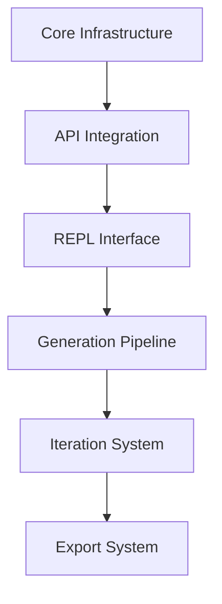

# AgenticAuthor Implementation Plan

## Executive Summary
A Python-based CLI tool for iterative book generation using OpenRouter API and multiple LLM models. The system follows a Level of Detail (LOD) approach, progressively refining from high-level premise (LOD3) to full prose (LOD0).

## Architecture Overview

### Core Technologies
- **Language**: Python 3.11+
- **API**: OpenRouter API for LLM access
- **CLI Framework**:
  - **Prompt Toolkit**: Interactive REPL with multi-line input, key bindings, history
  - **Rich**: Beautiful terminal output, markdown rendering, streaming display
  - **Typer**: Command parsing and subcommands
- **Async**: asyncio + aiohttp for streaming API responses
- **Storage**: File system with JSON/YAML for metadata and markdown for content
- **Version Control**: Git integration for every book project
- **Config**: YAML/JSON for settings and taxonomies

### Project Structure
```
AgenticAuthor/
├── src/
│   ├── cli/
│   │   ├── __init__.py
│   │   ├── main.py              # Entry point with CLI commands
│   │   ├── commands/            # Individual command implementations
│   │   │   ├── init.py          # Project initialization
│   │   │   ├── generate.py      # Generation commands
│   │   │   ├── model.py         # Model selection
│   │   │   ├── edit.py          # Content editing
│   │   │   └── export.py        # Export functionality
│   │   └── interactive.py       # REPL mode with prompt_toolkit
│   ├── api/
│   │   ├── __init__.py
│   │   ├── openrouter.py        # OpenRouter API client
│   │   ├── streaming.py         # SSE streaming with Rich display
│   │   ├── models.py            # Model discovery and metadata
│   │   └── auth.py             # API key management
│   ├── generation/
│   │   ├── __init__.py
│   │   ├── premise.py          # LOD3 premise generation
│   │   ├── treatment.py        # LOD2 story treatment
│   │   ├── chapters.py         # LOD2 chapter outlines
│   │   ├── prose.py           # LOD0 prose generation
│   │   ├── iteration.py       # LOD iteration with natural language feedback
│   │   ├── analysis.py        # Comprehensive story analysis
│   │   └── prompts/           # Prompt templates
│   │       ├── base.py
│   │       └── templates/     # YAML prompt templates
│   ├── models/
│   │   ├── __init__.py
│   │   ├── project.py         # Project data model
│   │   ├── story.py           # Story structure models
│   │   └── taxonomy.py        # Taxonomy models
│   ├── storage/
│   │   ├── __init__.py
│   │   ├── project.py         # Project file management
│   │   ├── filesystem.py      # File I/O operations
│   │   ├── git_manager.py     # Git operations and version control
│   │   └── cache.py          # Model/response caching
│   ├── utils/
│   │   ├── __init__.py
│   │   ├── formatting.py      # Text formatting utilities
│   │   ├── validation.py      # Input validation
│   │   ├── progress.py        # Rich progress bars and live display
│   │   └── tokens.py          # Token counting/management
│   └── config/
│       ├── __init__.py
│       ├── settings.py        # Configuration management
│       └── constants.py       # Application constants
├── taxonomies/               # Genre taxonomy definitions
│   ├── base-taxonomy.json
│   ├── fantasy-taxonomy.json
│   ├── romance-taxonomy.json
│   └── ...
├── books/                   # Generated book projects
│   └── [project-name]/      # Individual book project (git repository)
│       ├── .git/            # Git repository for version control
│       ├── project.yaml     # Project metadata
│       ├── premise.md       # LOD3 premise
│       ├── treatment.md     # LOD2 treatment
│       ├── chapters.yaml    # Chapter outlines
│       ├── chapters/        # Generated prose (updates in place)
│       │   ├── chapter-01.md
│       │   ├── chapter-02.md
│       │   └── ...
│       ├── analysis/        # Analysis results (tracked in git)
│       │   ├── commercial.md
│       │   ├── plot.md
│       │   ├── characters.md
│       │   ├── elements.md
│       │   └── world-building.md
│       └── exports/         # Export formats
├── tests/                   # Test suite
├── docs/                    # Documentation
├── pyproject.toml          # Project dependencies
├── config.yaml             # Default configuration
└── README.md

```

## Implementation Blueprint

### Build Order and Dependencies



### Phase 1: Core Infrastructure

#### 1.1 Project Initialization
**File**: `pyproject.toml`
```toml
[project]
name = "agentic-author"
version = "1.0.0"
requires-python = ">=3.11"
dependencies = [
    "prompt-toolkit>=3.0",
    "rich>=13.0",
    "typer>=0.9",
    "aiohttp>=3.9",
    "pydantic>=2.0",
    "pyyaml>=6.0",
    "jinja2>=3.1",
    "python-dotenv>=1.0",
    "pygments>=2.15",
]

[project.scripts]
agentic = "src.cli.main:app"
```

#### 1.2 Configuration System
**File**: `src/config/settings.py`
```python
from pydantic import BaseSettings, Field
from typing import Dict, Optional
from pathlib import Path

class Settings(BaseSettings):
    # API Configuration
    openrouter_api_key: str = Field(..., env="OPENROUTER_API_KEY")
    openrouter_base_url: str = "https://openrouter.ai/api/v1"

    # Storage paths
    books_dir: Path = Path("./books")
    taxonomies_dir: Path = Path("./taxonomies")
    cache_dir: Path = Path("./.cache")

    # Model configuration
    default_model: str = "anthropic/claude-opus-4.1"
    current_model: Optional[str] = None  # Set at runtime

    # Generation parameters (can vary by generation type)
    temperature: Dict[str, float] = {
        'premise': 0.9,      # Higher for creativity
        'treatment': 0.7,    # Balanced
        'chapters': 0.6,     # More structured
        'prose': 0.8,        # Creative prose
        'polish': 0.3        # Low for consistency
    }

    class Config:
        env_file = ".env"
```

**Implementation requirements**:
- Load from environment variables and config.yaml
- Validate API key format (must start with 'sk-or-')
- Create directories if they don't exist
- Cache configuration for session

### Phase 2: OpenRouter API Integration

#### 2.1 API Client Core
**File**: `src/api/openrouter.py`
```python
class OpenRouterClient:
    """Handles all OpenRouter API interactions with caching and retry logic."""

    async def discover_models(self) -> List[Model]:
        """
        Fetch available models with 1-hour cache.
        Returns list of Model objects with id, name, context_length, pricing.
        """

    async def streaming_completion(
        self,
        model: str,
        messages: List[Dict],
        on_token: Callable[[str, int], None],
        temperature: float = 0.7
    ) -> str:
        """
        Stream completion with Server-Sent Events.
        Calls on_token(content, token_count) for each chunk.
        Returns complete response.
        """

    def calculate_max_tokens(
        self,
        model_id: str,
        input_tokens: int
    ) -> int:
        """
        Dynamic token calculation based on context window.
        Safety buffer: max(input * 0.2, 2000).
        """
```

**Implementation requirements**:
- Cache model list in `~/.cache/agentic/models.json` (1 hour TTL)
- Implement exponential backoff: delays = [1, 2, 4, 8] seconds
- Parse SSE stream: handle 'data: [DONE]' and error events
- Track token usage and costs per request
- Handle rate limits (429) and server errors (5xx) with retry

#### 2.2 Model Management
**File**: `src/api/models.py`
```python
class ModelManager:
    """Manages single active model for all operations."""

    AVAILABLE_MODELS = [
        "anthropic/claude-opus-4.1",
        "openai/gpt-5",
        "anthropic/claude-sonnet-4",
        "google/gemini-2.5-pro",
        "xai/grok-4-fast",
        "mistral/mistral-large",
        "moonshot/kimi-k2",
    ]

    def __init__(self, settings: Settings):
        self.current_model = settings.default_model
        self.settings = settings

    def set_model(self, model_id: str):
        """Set active model for all subsequent operations."""
        if model_id not in self.AVAILABLE_MODELS:
            raise ValueError(f"Model {model_id} not available. Choose from: {self.AVAILABLE_MODELS}")
        self.current_model = model_id
        self.settings.current_model = model_id

    def get_current_model(self) -> str:
        """Get currently active model."""
        return self.current_model

    def list_models_table(self) -> Table:
        """Return Rich table with available models and current selection."""
```

### Phase 3: Interactive REPL Interface

#### 3.0 Main Entry Point
**File**: `src/cli/main.py`
```python
import typer
from pathlib import Path
from typing import Optional
import asyncio

app = typer.Typer(name="agentic", help="AI-powered book generation CLI")

@app.command(name="")  # Default command
def main(
    project: Optional[str] = typer.Argument(None, help="Project name to open"),
    new: bool = typer.Option(False, "--new", help="Create new project"),
):
    """Start AgenticAuthor interactive REPL."""
    from .interactive import AgenticREPL

    repl = AgenticREPL()

    if new and project:
        repl.create_project(project)
    elif project:
        repl.open_project(project)
    else:
        # Open last project or show project selector
        repl.auto_open()

    # Start REPL
    asyncio.run(repl.run())

@app.command()
def list():
    """List all book projects."""
    from ..storage.project import list_projects
    for project in list_projects():
        typer.echo(f"📚 {project.name} - {project.status}")

@app.command()
def export(
    project: str = typer.Argument(..., help="Project to export"),
    format: str = typer.Option("md", help="Export format: md, epub, pdf"),
):
    """Export project without entering REPL."""
    from ..cli.commands.export import ExportManager
    asyncio.run(ExportManager().export(project, format))

if __name__ == "__main__":
    app()
```

#### 3.1 REPL Core
**File**: `src/cli/interactive.py`
```python
from prompt_toolkit import PromptSession
from prompt_toolkit.key_binding import KeyBindings
from rich.console import Console
from rich.live import Live
from rich.markdown import Markdown

class AgenticREPL:
    """Main REPL interface with natural language and slash commands."""

    def __init__(self):
        self.session = PromptSession(
            multiline=True,
            key_bindings=self._create_bindings(),
            history=FileHistory('~/.agentic_history')
        )
        self.console = Console()

    def _create_bindings(self) -> KeyBindings:
        """
        Setup key bindings:
        - Escape: Stop generation
        - Ctrl+L: Clear screen
        - Shift+Enter: New line
        """

    async def run(self):
        """Main REPL loop with command parsing and natural language processing."""

    def _parse_command(self, text: str):
        """
        Parse input as:
        1. Slash command (/model, /generate, etc)
        2. Natural language (send to LLM for intent)
        """
```

**Implementation requirements**:
- Show header with: version, current model, project name
- Support multi-line input with Shift+Enter
- Stream responses with Live display using Rich
- Save command history between sessions
- Handle Ctrl+C gracefully (confirm exit)

#### 3.2 Slash Command Handler
**File**: `src/cli/commands/slash_commands.py`
```python
SLASH_COMMANDS = {
    '/model': handle_model_command,
    '/models': handle_models_list,
    '/generate': handle_generate,
    '/iterate': handle_iterate,
    '/polish': handle_polish,
    '/show': handle_show,
    '/export': handle_export,
    '/status': handle_status,
    '/help': handle_help,
    # ... more commands
}

async def handle_generate(args: List[str], project: Project):
    """
    Generate content based on args:
    - premise: Generate LOD3
    - treatment: Generate LOD2 treatment
    - chapters: Generate LOD2 chapter outlines
    - prose [n]: Generate LOD0 prose for chapter n or all
    """
```

### Phase 4: Generation Pipeline

#### 4.1 LOD3 - Premise Generation
**File**: `src/generation/premise.py`
```python
class PremiseGenerator:
    """Generates story premises with taxonomy."""

    async def generate(
        self,
        user_input: Optional[str] = None,
        genre: str = "fantasy"
    ) -> Premise:
        """
        Generate premise from user input or create new.
        Returns Premise object with text and taxonomy selections.
        """

    def _build_prompt(self, user_input: Optional[str], genre: str) -> str:
        """Build prompt using Jinja2 template."""
```

**Template**: `src/generation/prompts/templates/premise.j2`
```jinja2
Generate a compelling fiction premise for the {{ genre }} genre.


Build upon this concept: {{ user_input }}


REQUIREMENTS:
1. 2-3 sentences that capture the core conflict
2. Clear protagonist and stakes
3. Unique hook that sets it apart

TAXONOMY SELECTIONS (choose relevant):
{{ taxonomy | format_options }}

Return as JSON:
{
    "premise": "...",
    "taxonomySelections": {...}
}
```

#### 4.2 LOD2 - Treatment and Chapters
**File**: `src/generation/treatment.py`
```python
class TreatmentGenerator:
    """Generates story treatment from premise."""

    async def generate(
        self,
        premise: Premise,
        target_words: int = 2000
    ) -> Treatment:
        """
        Generate treatment with dynamic word count.
        Preserves premise essence while expanding detail.
        """
```

**File**: `src/generation/chapters.py`
```python
class ChapterGenerator:
    """Generates chapter outlines from treatment."""

    async def generate(
        self,
        treatment: Treatment,
        chapter_count: Optional[int] = None
    ) -> ChapterOutline:
        """
        Generate beat sheets for chapters.
        Auto-calculates chapter count if not provided.
        """
```

#### 4.3 LOD0 - Prose Generation
**File**: `src/generation/prose.py`
```python
class ProseGenerator:
    """Generates full prose from chapter beats."""

    async def generate_chapter(
        self,
        chapter_beats: List[str],
        chapter_num: int,
        treatment: Treatment,
        stream_callback: Optional[Callable] = None
    ) -> str:
        """
        Generate prose for single chapter.
        Streams tokens to callback if provided.
        """

    async def generate_all(
        self,
        outline: ChapterOutline,
        treatment: Treatment,
        parallel: bool = False
    ) -> Dict[int, str]:
        """
        Generate all chapters.
        If parallel=True, generate independent chapters concurrently.
        """
```

### Phase 5: Iteration System

#### 5.1 Natural Language Iteration Manager
**File**: `src/generation/iteration.py`
```python
class IterationManager:
    """Manages natural language feedback and iteration."""

    async def process_feedback(
        self,
        feedback: str,
        context: Dict[str, Any],
        git_manager: GitManager
    ) -> Union[IterationResult, ClarificationRequest]:
        """
        Process user feedback with smart intent checking.
        Returns either executed result or clarification request.
        """
        # Single context-aware LLM call
        intent = await self._check_intent(feedback, context)

        if intent['confidence'] > 0.8:
            # Clear intent - execute immediately
            result = await self._execute_iteration(intent)
            # Auto-commit with descriptive message
            git_manager.commit(f"{intent['action']}: {intent['description']}")
            return result
        else:
            # Ambiguous - request clarification
            return ClarificationRequest(
                message=intent['clarification'],
                options=intent['options']
            )

    async def _check_intent(
        self,
        feedback: str,
        context: Dict
    ) -> Dict:
        """
        Single LLM call with structured JSON response.
        Returns confidence level and action details.
        """
        prompt = f"""
        Story Context:
        - Current: {context['current_file']}
        - Beats: {context['beats']}
        - Stats: {context['stats']}

        User Feedback: "{feedback}"

        Return JSON:
        {{
            "confidence": 0.0-1.0,
            "action": "action_type" (if confidence > 0.8),
            "target": "specific_target" (if confidence > 0.8),
            "description": "what will be done",
            "clarification": "question to ask" (if confidence <= 0.8),
            "options": ["option1", "option2"] (if confidence <= 0.8)
        }}
        """
        return await self.llm.structured_call(prompt, response_format="json")
```

#### 5.2 Git Integration Manager
**File**: `src/storage/git_manager.py`
```python
class GitManager:
    """Handles all git operations for book projects."""

    def __init__(self, project_path: Path):
        self.project_path = project_path
        self.repo = self._init_or_open_repo()

    def _init_or_open_repo(self):
        """Initialize new repo or open existing."""
        if not (self.project_path / '.git').exists():
            subprocess.run(['git', 'init'], cwd=self.project_path)
        return self.project_path

    def commit(self, message: str) -> str:
        """Auto-commit all changes with descriptive message."""
        subprocess.run(['git', 'add', '-A'], cwd=self.project_path)
        result = subprocess.run(
            ['git', 'commit', '-m', message],
            cwd=self.project_path,
            capture_output=True
        )
        # Get commit SHA
        sha = subprocess.run(
            ['git', 'rev-parse', 'HEAD'],
            cwd=self.project_path,
            capture_output=True,
            text=True
        ).stdout.strip()[:7]
        return sha

    def diff(self, file: Optional[str] = None) -> str:
        """Show unified diff of changes."""
        cmd = ['git', 'diff']
        if file:
            cmd.append(file)
        return subprocess.run(
            cmd, cwd=self.project_path,
            capture_output=True, text=True
        ).stdout

    def get_current_sha(self) -> str:
        """Get current commit SHA for analysis tracking."""
        return subprocess.run(
            ['git', 'rev-parse', 'HEAD'],
            cwd=self.project_path,
            capture_output=True, text=True
        ).stdout.strip()[:7]
```

### Phase 6: Export System

#### 6.1 Export Manager
**File**: `src/cli/commands/export.py`
```python
class ExportManager:
    """Handles export to various formats."""

    async def export_markdown(self, project: Project) -> Path:
        """Combine all content into single markdown file."""

    async def export_epub(self, project: Project) -> Path:
        """Generate EPUB with proper metadata and formatting."""

    async def export_pdf(self, project: Project) -> Path:
        """Generate PDF with appropriate typography."""
```

### Testing Strategy

#### Unit Test Structure
```
tests/
├── test_api/
│   ├── test_openrouter.py      # Mock API responses
│   └── test_streaming.py       # SSE parsing
├── test_generation/
│   ├── test_premise.py         # Premise generation
│   ├── test_treatment.py       # Treatment generation
│   └── test_iteration.py       # Iteration logic
└── test_cli/
    ├── test_repl.py            # REPL commands
    └── test_slash_commands.py   # Command parsing
```

#### Integration Test Example
```python
async def test_full_generation_pipeline():
    """Test complete LOD3 → LOD2 → LOD0 generation."""
    # Create premise
    premise = await generate_premise("A story about time travel")
    assert premise.taxonomy_selections

    # Generate treatment
    treatment = await generate_treatment(premise)
    assert 1500 < len(treatment.text.split()) < 2500

    # Generate chapters
    outline = await generate_chapters(treatment)
    assert len(outline.chapters) > 0

    # Generate prose for first chapter
    prose = await generate_prose(outline.chapters[0], treatment)
    assert len(prose.split()) > 1000
```

### Success Criteria

Each phase is complete when:

1. **Core Infrastructure**: Settings load, directories exist, logging works
2. **API Integration**: Can list models, stream completions, handle errors
3. **REPL Interface**: Natural language input works, slash commands execute
4. **Generation Pipeline**: Can generate complete book from premise to prose
5. **Iteration System**: Can modify any LOD level and track dependencies
6. **Export System**: Can export to markdown, EPUB, and PDF formats

### Error Handling Patterns

```python
# Consistent error handling across all modules
class GenerationError(Exception):
    """Base class for generation errors."""

class APIError(GenerationError):
    """API-related errors with retry capability."""

class ValidationError(GenerationError):
    """Content validation failures."""

# Usage pattern
try:
    result = await generate_treatment(premise)
except APIError as e:
    if e.retryable:
        # Retry with backoff
    else:
        # Show error to user
except ValidationError as e:
    # Prompt user for corrections
```

## Model Strategy

### Available Models for Creative Writing

1. **Claude Opus 4.1** (`anthropic/claude-opus-4.1`)
   - Best for: Character development, emotional depth, literary prose
   - Context: 200K tokens
   - Strengths: Nuanced writing, complex narratives

2. **GPT-5** (`openai/gpt-5`)
   - Best for: Structured storytelling, vivid prose, reduced hallucinations
   - Context: 128K tokens
   - Strengths: Logical consistency, rich metaphors

3. **Claude Sonnet 4** (`anthropic/claude-sonnet-4`)
   - Best for: Creative writing, dialogue, style refinement
   - Context: 200K tokens
   - Strengths: Natural dialogue, character voice

4. **Gemini 2.5 Pro** (`google/gemini-2.5-pro`)
   - Best for: Long context handling, maintaining consistency
   - Context: 1M tokens
   - Strengths: Can process entire novels at once

5. **Grok 4 Fast** (`xai/grok-4-fast`)
   - Best for: Witty content, humor, unique voice
   - Context: 128K tokens
   - Strengths: Comedy, satire, irreverent tone

6. **Mistral Large** (`mistral/mistral-large`)
   - Best for: Balanced performance, European sensibilities
   - Context: 128K tokens
   - Strengths: Versatile, cost-effective

7. **Kimi K2** (`moonshot/kimi-k2`)
   - Best for: Long-form content, detailed narratives
   - Context: 200K tokens
   - Strengths: Maintaining plot coherence

### Model Selection Approach
```python
# Single active model for all operations
class ModelManager:
    def __init__(self):
        self.active_model = "anthropic/claude-opus-4.1"  # Default

    def set_model(self, model_id: str):
        """Switch active model for all subsequent operations."""
        if model_id not in AVAILABLE_MODELS:
            raise ValueError(f"Model {model_id} not available")
        self.active_model = model_id

    def get_current_model(self) -> str:
        """Return currently active model."""
        return self.active_model

AVAILABLE_MODELS = [
    "anthropic/claude-opus-4.1",
    "openai/gpt-5",
    "anthropic/claude-sonnet-4",
    "google/gemini-2.5-pro",
    "xai/grok-4-fast",
    "mistral/mistral-large",
    "moonshot/kimi-k2",
]
```

## Interactive Interface

### Claude Code-Style REPL Mode
The primary interface is an interactive REPL (Read-Eval-Print Loop) that mimics Claude Code's experience:

#### Key Features:
1. **Natural Language Input**
   - Multi-line message support (Shift+Enter for new line)
   - Stream responses in real-time with markdown formatting
   - Contextual awareness of current project and LOD level

2. **Keybindings**
   - `Escape`: Stop current generation
   - `Ctrl+C`: Exit application
   - `Ctrl+L`: Clear screen
   - `Up/Down`: Navigate command history
   - `Tab`: Auto-complete commands
   - `Ctrl+R`: Search history

3. **Slash Commands** (Available in REPL)
   - `/model [model-id]` - Switch active model for all operations
   - `/models` - List available models with current selection
   - `/generate [component]` - Generate specific LOD level
   - `/edit [component]` - Edit existing content
   - `/show [component]` - Display current content
   - `/export [format]` - Export in various formats
   - `/status` - Show project status
   - `/history` - View generation history
   - `/undo` - Revert last change
   - `/save` - Save current state
   - `/help` - Show available commands
   - `/clear` - Clear conversation context
   - `/quit` or `/exit` - Exit application

4. **Visual Feedback**
   - Rich markdown rendering for all outputs
   - Syntax highlighting for code blocks
   - Live progress bars during generation
   - Token count display
   - Cost estimation in real-time
   - Model indicator in prompt

#### Example Interactive Session:
```
AgenticAuthor v1.0 | Current Model: anthropic/claude-opus-4.1 | Project: my-fantasy-novel
──────────────────────────────────────────────────────────────────────────────────────

> Let's create a fantasy novel about a young mage discovering ancient magic

[Generating premise with anthropic/claude-opus-4.1...]
✓ Premise generated (150 tokens, $0.02)

**Premise:**
In a world where magic has been industrialized and regulated, a young
academy dropout discovers fragments of the old wild magic that once
shaped reality itself, setting her on a collision course with both the
magical establishment and an ancient evil stirring in response to her
awakening power.

> /generate treatment

[Generating treatment from premise using anthropic/claude-opus-4.1...]
[████████████████████░░░░░░] 75% | 1,847 tokens | Streaming...

> This looks good, but make the protagonist older and more experienced

[Regenerating treatment with modifications using anthropic/claude-opus-4.1...]
✓ Treatment updated (2,450 tokens, $0.31)

> /models

Available Models (✓ = current):
┌─────────────────────────────┬──────────┬──────────────────────────┐
│ Model                       │ Context  │ Best For                 │
├─────────────────────────────┼──────────┼──────────────────────────┤
│ ✓ anthropic/claude-opus-4.1│ 200K     │ Literary prose, depth    │
│   openai/gpt-5              │ 128K     │ Structure, consistency   │
│   anthropic/claude-sonnet-4 │ 200K     │ Dialogue, refinement     │
│   google/gemini-2.5-pro     │ 1M       │ Long context, full books │
│   xai/grok-4-fast           │ 128K     │ Humor, unique voice      │
│   mistral/mistral-large     │ 128K     │ Balanced, versatile      │
│   moonshot/kimi-k2          │ 200K     │ Plot coherence           │
└─────────────────────────────┴──────────┴──────────────────────────┘

> /model google/gemini-2.5-pro
✓ Switched to google/gemini-2.5-pro (all future operations will use this model)

> continue with chapter generation
[Generating chapter outlines with google/gemini-2.5-pro...]
```

## LOD Iteration and Refinement

### Overview
The iteration system uses natural language feedback with smart intent checking, backed by git for complete version control. Every generation and iteration is auto-committed with descriptive messages.

### Natural Language Feedback System
- **Always Listening**: System accepts feedback immediately after any generation
- **Smart Intent Checking**: Single context-aware LLM call determines intent
- **Confidence-Based Routing**:
  - High confidence (>0.8): Execute immediately
  - Low confidence (≤0.8): Ask for clarification
- **Git Integration**: Auto-commit after every change

### Iteration at Each Level

#### LOD3 - Premise Iteration
- **What can change**: Core concept, genre, themes, setting
- **Preserves**: Project structure
- **Cascading effect**: All lower levels marked as "needs regeneration"
- **Use cases**:
  - Pivoting story concept
  - Changing genre or target audience
  - Refining the core hook

#### LOD2 - Treatment/Chapter Iteration
- **What can change**: Plot structure, character arcs, chapter organization
- **Preserves**: Core premise and taxonomy
- **Cascading effect**: Prose marked as "outdated" but not deleted
- **Use cases**:
  - Restructuring plot
  - Adding/removing subplots
  - Adjusting pacing
  - Changing chapter count

#### LOD0 - Prose Iteration
- **What can change**: Writing style, tone, specific scenes, dialogue
- **Preserves**: Story structure and beats
- **Two modes**:
  1. **Regeneration**: Complete rewrite following beats
  2. **Polish**: Grammar, style, pacing improvements only
- **Use cases**:
  - Style adjustments
  - Adding more action/dialogue
  - Copy editing
  - Consistency fixes

### Git-Based Version Control

Every book project is a git repository with automatic versioning:

#### Commit Message Format
```
Generate premise: young mage discovers ancient magic
Generate treatment from premise (2500 words)
Iterate chapter 3: add dialogue to confrontation
Polish chapter 5: grammar and pacing
Analyze: commercial viability at abc123def
```

#### Git Operations
- **Auto-commit**: After every generation/iteration
- **Diff viewing**: `git diff` shows unified diffs
- **History**: Complete evolution tracked in git log
- **Rollback**: Easy reversion to any previous state
- **Branching**: Experimental changes on separate branches

### Iteration Commands in REPL

```
# Natural language feedback (primary mode)
> Make the villain more sympathetic
[System detects: treatment-level change]
[Commits: "Iterate treatment: make villain more sympathetic"]

> Add more dialogue to chapter 5
[System detects: chapter-level, high confidence]
[Regenerates chapter 5 with more dialogue]
[Commits: "Iterate chapter 5: add more dialogue"]

> This needs better pacing
[System asks: "Better pacing for chapter 5 or entire story?"]
> Just chapter 5
[Applies pacing improvements]
[Commits: "Polish chapter 5: improve pacing"]

# Git-related commands
/diff                    # Show uncommitted changes
/history                 # Show git log
/rollback               # Revert last commit
/branch experimental    # Create branch for experiments

# Analysis command
/analyze                # Run comprehensive analysis
[Creates/updates files in analysis/ directory]
[Commits: "Analyze: full story analysis at abc123"]
```

### Analysis System

Comprehensive story analysis based on dv-story-generator features:

#### Analysis Components
1. **Commercial Viability**: Market readiness (0-100%)
2. **Plot Consistency**: Plot holes, timeline issues
3. **Character Development**: Arc tracking, motivations
4. **World-Building**: Setting consistency
5. **Story Elements**: Themes, conflicts, relationships

#### Analysis Workflow
```python
# Run analysis
> /analyze

# Creates/updates files in analysis/ directory:
analysis/
├── commercial.md      # Market viability (78% ready)
├── plot.md           # Plot holes and issues
├── characters.md     # Character consistency
├── elements.md       # Story components
└── world-building.md # World consistency

# Each file includes git SHA reference:
# Commercial Viability Analysis
Git SHA: abc123def
Analyzed: 2024-01-15 10:30:00
Model: anthropic/claude-opus-4.1
```

#### Analysis Integration
- Files overwritten on new analysis (git tracks history)
- Results can guide iteration decisions
- Suggestions can be applied via natural language feedback

## CLI Commands

### Startup Commands
```bash
# Primary usage - starts interactive REPL
agentic                            # Start REPL, auto-opens last project
agentic [project-name]             # Start REPL with specific project
agentic new [project-name]         # Create new project and enter REPL

# Direct commands (non-interactive)
agentic --list                     # List all projects
agentic --export [project] [fmt]   # Quick export without entering REPL
agentic --version                  # Show version info
agentic --help                     # Show help
```

### REPL Natural Language Commands
In the REPL, you can use natural language for most operations:
```
> Create a fantasy novel about dragons and magic
> Make the protagonist a veteran warrior instead
> Generate the full treatment now
> Let's work on chapter 3
> Rewrite this chapter with more action
> Show me what we have so far
> Export everything to markdown
```

### REPL Slash Commands Reference
```
/model [id]          # Switch active model (applies to all operations)
/models              # Show available models with current selection
/generate [what]     # Generate: premise|treatment|chapters|prose|all
/iterate [what]      # Iterate on existing content with changes
/polish [what]       # Polish prose (grammar/style only)
/edit [what]         # Manual edit: premise|treatment|chapter N
/show [what]         # Display: premise|treatment|chapters|prose|all
/status              # Current project status and progress
/status --iterations # Show iteration history
/diff [what]         # Show changes from last version
/rollback [what]     # Revert to previous version
/history             # Show generation history
/undo                # Undo last change
/redo                # Redo undone change
/save                # Save current state
/export [format]     # Export: md|epub|pdf|html|json
/stats               # Token usage and costs
/clear               # Clear conversation context
/help                # Show this help
/quit                # Exit application
```

## Storage Strategy

### File-Based Project Structure
Each book project is self-contained in its own directory with all files in human-readable formats:

```
books/[project-name]/
├── project.yaml           # Project metadata
│   # - creation_date
│   # - last_modified
│   # - model_selections
│   # - taxonomy_selections
│   # - generation_parameters
│   # - status (current LOD level)
│   # - iteration_history: [{timestamp, level, change, affected}]
│   # - dependency_status: {premise, treatment, chapters, prose: {ch1, ch2...}}
│   # - edit_status: {premise, treatment, chapters, prose: {ch1, ch2...}}
├── premise.md             # LOD3: Core premise and concept
├── treatment.md           # LOD2: Full story treatment
├── chapters.yaml          # LOD2: Chapter outlines/beats
│   # - chapter_count
│   # - chapters: [{title, beats: [...]}]
├── chapters/              # LOD0: Generated prose (updates in place)
│   ├── chapter-01.md      # Tracks: raw → polished
│   ├── chapter-02.md
│   └── ...
├── summary.md             # Marketing blurb and metadata
├── exports/               # Final outputs
│   ├── full-book.md
│   ├── book.epub
│   └── book.pdf
└── .history/              # Version history
    └── [timestamp]/       # Auto-saved before major iterations
        ├── premise.md
        ├── treatment.md
        └── chapters/
```

### Advantages of File-Based Storage
1. **Simplicity**: No database setup or migrations
2. **Transparency**: All content readable in any text editor
3. **Version Control**: Works perfectly with Git
4. **Portability**: Easy to share/backup entire projects
5. **Debugging**: Can manually edit files if needed
6. **Integration**: Works with existing markdown tools

### File Format Choices
- **Markdown (.md)**: All prose content for readability
- **YAML (.yaml)**: Structured data (metadata, outlines)
- **JSON (.json)**: Taxonomies and API responses
- **HTML (.html)**: Formatted/edited content
- **Plain text**: Logs and temporary files

## Configuration

### config.yaml Structure
```yaml
api:
  provider: openrouter
  base_url: https://openrouter.ai/api/v1
  timeout: 300
  max_retries: 3

models:
  defaults:
    premise: google/gemini-2.5-flash
    treatment: openai/gpt-4o
    chapters: openai/gpt-4o
    prose: anthropic/claude-opus-4.1
    editing: anthropic/claude-sonnet-4

generation:
  temperature:
    premise: 0.9
    treatment: 0.7
    chapters: 0.6
    prose: 0.8
    editing: 0.3
  top_p: 0.95

storage:
  projects_dir: ./books
  cache_dir: ./.cache
  backup_enabled: true

ui:
  streaming: true
  progress_bar: true
  color_output: true
  verbose: false
```

## Git Integration Architecture

### Core Git Manager
**File**: `src/storage/git_manager.py`

#### Design Principles
1. **Subprocess over GitPython**: Direct git commands for simplicity and debugging
2. **Auto-commit Everything**: Every operation creates a commit
3. **Descriptive Messages**: Human-readable commit messages
4. **Error Recovery**: Handle git failures gracefully

#### Implementation
```python
class GitManager:
    """Centralized git operations for book projects."""

    def __init__(self, project_path: Path):
        self.project_path = project_path
        self._ensure_git_available()
        self._init_or_open_repo()

    def _ensure_git_available(self):
        """Check that git is installed."""
        try:
            subprocess.run(['git', '--version'],
                         capture_output=True, check=True)
        except (FileNotFoundError, subprocess.CalledProcessError):
            raise RuntimeError("Git is not installed or not in PATH")

    def commit_generation(self,
                         component: str,
                         details: str = "") -> str:
        """Commit after generation with standard format."""
        message = f"Generate {component}"
        if details:
            message += f": {details}"
        return self.commit(message)

    def commit_iteration(self,
                        component: str,
                        change: str) -> str:
        """Commit after iteration with change description."""
        message = f"Iterate {component}: {change}"
        return self.commit(message)

    def commit_analysis(self,
                       analysis_type: str) -> str:
        """Commit analysis results with SHA reference."""
        sha = self.get_current_sha()
        message = f"Analyze: {analysis_type} at {sha}"
        return self.commit(message)

    def show_diff(self,
                 file: Optional[str] = None,
                 cached: bool = False) -> str:
        """Show unified diff for review."""
        cmd = ['git', 'diff']
        if cached:
            cmd.append('--cached')
        if file:
            cmd.append(file)
        return self._run_git(cmd)

    def rollback(self, steps: int = 1) -> None:
        """Rollback N commits (default 1)."""
        self._run_git(['git', 'reset', '--hard', f'HEAD~{steps}'])

    def create_branch(self, name: str) -> None:
        """Create and switch to new branch for experiments."""
        self._run_git(['git', 'checkout', '-b', name])

    def _run_git(self, cmd: List[str]) -> str:
        """Execute git command with error handling."""
        try:
            result = subprocess.run(
                cmd,
                cwd=self.project_path,
                capture_output=True,
                text=True,
                check=True
            )
            return result.stdout
        except subprocess.CalledProcessError as e:
            logger.error(f"Git command failed: {e.stderr}")
            raise GitError(f"Git operation failed: {e.stderr}")
```

#### Error Handling
```python
class GitError(Exception):
    """Base exception for git operations."""
    pass

class GitNotInstalledError(GitError):
    """Git is not available on system."""
    pass

class GitConflictError(GitError):
    """Merge conflict or similar issue."""
    pass
```

### Git Workflow Integration

#### Generation Flow
```python
async def generate_with_git(component: str, generator_func, git_manager: GitManager):
    """Standard generation workflow with git integration."""
    try:
        # Generate content
        result = await generator_func()

        # Save to files
        save_component(component, result)

        # Auto-commit
        details = get_generation_details(result)
        git_manager.commit_generation(component, details)

        return result
    except Exception as e:
        # On failure, reset to clean state
        git_manager.rollback()
        raise
```

#### Iteration Flow
```python
async def iterate_with_git(feedback: str, context: dict, git_manager: GitManager):
    """Iteration workflow with git integration."""
    # Check intent
    intent = await check_intent(feedback, context)

    if intent['confidence'] > 0.8:
        # Apply changes
        result = await apply_iteration(intent)

        # Commit with descriptive message
        git_manager.commit_iteration(
            component=intent['target'],
            change=intent['description']
        )

        # Show diff to user
        diff = git_manager.show_diff(intent['target'])
        display_diff(diff)

        return result
    else:
        # Request clarification
        return request_clarification(intent)
```

### Git Best Practices

1. **Atomic Commits**: Each logical change in its own commit
2. **Meaningful Messages**: Follow format convention
3. **Regular Tags**: Tag milestones ("draft-complete", "edited-v1")
4. **Branch Strategy**: Main for stable, branches for experiments
5. **Ignore Patterns**: `.gitignore` for cache and temporary files

## Error Handling

### Comprehensive Error Strategy
```python
class ErrorHandler:
    """Centralized error handling with recovery strategies."""

    @staticmethod
    def handle_api_error(e: APIError, retries: int = 3):
        """Handle API errors with exponential backoff."""
        if e.retryable and retries > 0:
            delay = 2 ** (4 - retries)  # 1, 2, 4, 8 seconds
            time.sleep(delay)
            return True  # Retry
        else:
            # Log and display user-friendly message
            logger.error(f"API error: {e}")
            display_error("API request failed. Please try again.")
            return False

    @staticmethod
    def handle_generation_error(e: GenerationError, git_manager: GitManager):
        """Handle generation failures with git rollback."""
        # Rollback to clean state
        git_manager.rollback()

        # Inform user
        display_error(f"Generation failed: {e}. Rolled back to previous state.")

        # Offer retry options
        return prompt_retry_options()

    @staticmethod
    def handle_git_error(e: GitError):
        """Handle git operation failures."""
        if isinstance(e, GitNotInstalledError):
            display_error("Git is required but not installed. Please install git.")
            sys.exit(1)
        elif isinstance(e, GitConflictError):
            display_error("Git conflict detected. Manual resolution required.")
            return prompt_conflict_resolution()
        else:
            logger.error(f"Git error: {e}")
            display_warning("Git operation failed, but content was saved.")
```

## Test-Driven Development Strategy

### Test Book Fixture System

#### Core Concept
Use a real book generated with a cheap/fast model as the test fixture, tracked in git for consistent baseline.

#### Test Book Setup
```python
class TestBookFixture:
    """Manages test book for integration testing."""

    TEST_MODEL = "xai/grok-4-fast"  # Fast and cheap
    TEST_BOOK_PATH = Path("tests/fixtures/test-book")

    @classmethod
    def setup_test_book(cls):
        """Generate or reset test book to baseline."""
        if cls.TEST_BOOK_PATH.exists():
            # Reset to baseline using git
            subprocess.run(['git', 'checkout', 'HEAD', '.'],
                         cwd=cls.TEST_BOOK_PATH)
        else:
            # Generate fresh test book
            await cls._generate_baseline_book()

    @classmethod
    async def _generate_baseline_book(cls):
        """Generate complete test book with all LOD levels."""
        # Use simple premise for consistency
        premise = "A young apprentice discovers a hidden magical library"

        # Generate all components
        treatment = await generate_treatment(premise, model=cls.TEST_MODEL)
        chapters = await generate_chapters(treatment, model=cls.TEST_MODEL)
        prose = await generate_prose(chapters, model=cls.TEST_MODEL)

        # Initialize git and create baseline commit
        subprocess.run(['git', 'init'], cwd=cls.TEST_BOOK_PATH)
        subprocess.run(['git', 'add', '-A'], cwd=cls.TEST_BOOK_PATH)
        subprocess.run(['git', 'commit', '-m', 'Test book baseline'],
                     cwd=cls.TEST_BOOK_PATH)
        subprocess.run(['git', 'tag', 'baseline'], cwd=cls.TEST_BOOK_PATH)
```

#### Test Categories

##### 1. Generation Tests
```python
class TestGeneration:
    def setup_method(self):
        """Reset test book to baseline before each test."""
        TestBookFixture.setup_test_book()

    async def test_premise_generation(self):
        """Test premise generation and git commit."""
        premise = await generate_premise("fantasy with dragons")
        assert "dragon" in premise.text.lower()

        # Check git commit was created
        log = subprocess.run(['git', 'log', '--oneline', '-1'],
                           capture_output=True, text=True)
        assert "Generate premise" in log.stdout

    async def test_treatment_from_premise(self):
        """Test treatment generation from existing premise."""
        # Load test premise
        premise = load_file("premise.md")
        treatment = await generate_treatment(premise)

        # Verify word count and structure
        assert 500 <= len(treatment.split()) <= 3000
        assert treatment.startswith("#")  # Has headers

    async def test_full_pipeline(self):
        """Test complete LOD3 → LOD2 → LOD0 generation."""
        # Start fresh
        premise = await generate_premise()
        treatment = await generate_treatment(premise)
        chapters = await generate_chapters(treatment)
        prose = await generate_prose(chapters[0])

        # Verify all files exist and are tracked
        assert Path("premise.md").exists()
        assert Path("treatment.md").exists()
        assert Path("chapters/chapter-01.md").exists()

        # Check git history shows progression
        log = subprocess.run(['git', 'log', '--oneline'],
                           capture_output=True, text=True)
        assert "Generate premise" in log.stdout
        assert "Generate treatment" in log.stdout
        assert "Generate chapter 1" in log.stdout
```

##### 2. Iteration Tests
```python
class TestIteration:
    async def test_natural_language_feedback(self):
        """Test natural language iteration with intent checking."""
        # Load test chapter
        chapter = load_file("chapters/chapter-01.md")

        # Test clear intent
        result = await process_feedback(
            "Add more dialogue to the confrontation scene",
            context={"file": "chapter-01.md", "beats": [...]}
        )
        assert result.executed == True
        assert "dialogue" in result.changes

        # Check git commit
        log = get_last_commit_message()
        assert "add dialogue to confrontation" in log.lower()

    async def test_ambiguous_feedback(self):
        """Test clarification request for ambiguous feedback."""
        result = await process_feedback(
            "Make it better",
            context={"file": "chapter-01.md"}
        )
        assert isinstance(result, ClarificationRequest)
        assert len(result.options) > 0

    async def test_iteration_with_git_diff(self):
        """Test that iteration creates proper git diffs."""
        # Iterate on chapter
        await process_feedback("Add more action")

        # Get diff
        diff = subprocess.run(['git', 'diff', 'HEAD~1'],
                            capture_output=True, text=True)

        # Verify diff format
        assert "@@" in diff.stdout  # Has hunks
        assert "+" in diff.stdout   # Has additions
        assert "-" in diff.stdout   # Has deletions
```

##### 3. Analysis Tests
```python
class TestAnalysis:
    async def test_commercial_viability_analysis(self):
        """Test market readiness assessment."""
        result = await analyze_commercial_viability()

        # Check analysis file created
        assert Path("analysis/commercial.md").exists()

        # Verify content structure
        content = load_file("analysis/commercial.md")
        assert "Git SHA:" in content
        assert "Market Readiness:" in content
        assert "%" in content  # Has percentage score

        # Check git commit
        log = get_last_commit_message()
        assert "Analyze: commercial viability" in log

    async def test_plot_hole_detection(self):
        """Test plot consistency analysis."""
        # Inject known plot hole in test book
        edit_file("chapters/chapter-01.md",
                 "Maya has blue eyes",
                 "Maya has green eyes")
        edit_file("chapters/chapter-03.md",
                 add="Maya's blue eyes sparkled")

        # Run analysis
        result = await analyze_plot_consistency()

        # Should detect eye color inconsistency
        assert "eye" in result.lower()
        assert "inconsistent" in result.lower()

    async def test_full_analysis_suite(self):
        """Test complete analysis workflow."""
        await run_full_analysis()

        # Check all analysis files created
        for file in ['commercial', 'plot', 'characters', 'elements', 'world-building']:
            assert Path(f"analysis/{file}.md").exists()

        # Verify git SHA references match
        current_sha = get_current_sha()
        for file in Path("analysis").glob("*.md"):
            content = file.read_text()
            assert current_sha in content
```

##### 4. Git Integration Tests
```python
class TestGitIntegration:
    def test_auto_commit_on_generation(self):
        """Test that every generation creates a commit."""
        initial_count = get_commit_count()

        # Generate content
        generate_premise()
        generate_treatment()

        final_count = get_commit_count()
        assert final_count == initial_count + 2

    def test_rollback_functionality(self):
        """Test reverting to previous version."""
        # Save original
        original = load_file("premise.md")

        # Make change
        iterate_premise("make it darker")
        changed = load_file("premise.md")
        assert original != changed

        # Rollback
        rollback_last_commit()
        reverted = load_file("premise.md")
        assert reverted == original

    def test_branch_for_experiments(self):
        """Test branching for experimental changes."""
        # Create experimental branch
        create_branch("experimental")

        # Make risky changes
        iterate_treatment("completely restructure plot")

        # Switch back to main
        checkout_branch("main")

        # Original should be unchanged
        treatment = load_file("treatment.md")
        assert "restructure" not in treatment
```

### Test Execution Strategy

#### Continuous Integration
```yaml
# .github/workflows/test.yml
name: Test Suite
on: [push, pull_request]

jobs:
  test:
    runs-on: ubuntu-latest
    steps:
      - uses: actions/checkout@v2
      - uses: actions/setup-python@v2
        with:
          python-version: '3.11'
      - run: pip install -e .[dev]
      - run: pytest tests/ -v --cov=src --cov-report=term-missing
      - run: pytest tests/integration/ --test-book-reset
```

#### Local Testing
```bash
# Run all tests with fixture reset
pytest tests/ --reset-fixtures

# Run specific test category
pytest tests/test_iteration.py -v

# Run with coverage
pytest --cov=src --cov-report=html

# Run integration tests only
pytest tests/integration/ -m integration
```

### Test Configuration
```python
# tests/conftest.py
import pytest
from pathlib import Path

@pytest.fixture(scope="session")
def test_book():
    """Provide test book fixture for all tests."""
    TestBookFixture.setup_test_book()
    yield TestBookFixture.TEST_BOOK_PATH
    # Cleanup if needed

@pytest.fixture
def clean_test_book(test_book):
    """Reset test book before each test."""
    subprocess.run(['git', 'reset', '--hard', 'baseline'],
                  cwd=test_book)
    yield test_book

@pytest.fixture
def mock_api():
    """Mock OpenRouter API for unit tests."""
    with patch('src.api.openrouter.OpenRouterClient') as mock:
        mock.streaming_completion.return_value = "Mocked response"
        yield mock
```

## Success Metrics

### Technical Metrics
- API success rate > 95%
- Generation completion rate > 90%
- Average response time < 5s for streaming start
- Cache hit rate > 70% for model queries

### Quality Metrics
- Coherent story structure
- Consistent character development
- Proper format compliance
- Successful export rate

### User Experience Metrics
- Interactive command response < 100ms
- Clear progress indication
- Helpful error messages
- Intuitive command structure

## Future Enhancements

### Version 2.0
- Web UI companion
- Real-time collaboration
- Custom fine-tuned models
- Advanced story analysis
- Market research integration
- Cover generation
- Audio narration

### Version 3.0
- Multi-book series support
- Character database
- World-building tools
- Style transfer
- Translation support
- Publishing automation

## Implementation Order

### Recommended Build Sequence

1. **Start with Core Infrastructure** - Settings, configuration, directory setup
2. **Build API Integration** - OpenRouter client with caching and retry logic
3. **Create REPL Interface** - Interactive shell with prompt_toolkit and rich
4. **Implement Generation Pipeline** - LOD3 → LOD2 → LOD0 in sequence
5. **Add Iteration System** - Regeneration and polish capabilities
6. **Complete Export System** - Multiple output formats

### Implementation Notes for LLMs

- **Use Type Hints**: All functions should have complete type annotations
- **Follow Async Patterns**: Use `async/await` consistently for I/O operations
- **Implement Error Boundaries**: Each module should handle its own errors gracefully
- **Create Tests Alongside Code**: Write unit tests immediately after implementing each class
- **Use Dependency Injection**: Pass clients and managers as parameters, not globals
- **Log Everything**: Use structured logging with appropriate levels (DEBUG/INFO/WARNING/ERROR)

## Dependencies

### Core Dependencies
```toml
[project]
dependencies = [
    "prompt-toolkit>=3.0",      # Interactive REPL interface
    "rich>=13.0",               # Beautiful terminal output
    "typer>=0.9",               # Command-line parsing
    "aiohttp>=3.9",             # Async HTTP for API calls
    "pydantic>=2.0",            # Data validation
    "pyyaml>=6.0",              # YAML parsing
    "jinja2>=3.1",              # Template rendering
    "python-dotenv>=1.0",       # Environment variables
    "pygments>=2.15",           # Syntax highlighting
]

[project.optional-dependencies]
dev = [
    "pytest>=7.0",
    "pytest-asyncio>=0.21",
    "ruff>=0.1",
    "black>=23.0",
    "mypy>=1.0",
]

export = [
    "markdown>=3.5",
    "ebooklib>=0.18",
    "reportlab>=4.0",
]
```

## LLM Implementation Guide

### Quick Start for Implementation

When implementing this project, follow this exact sequence:

1. **Create project structure** - All directories and empty `__init__.py` files
2. **Copy `pyproject.toml`** - Install all dependencies
3. **Implement `Settings` class** - Get configuration working first
4. **Build `OpenRouterClient`** - Start with `discover_models()`, then `streaming_completion()`
5. **Create minimal REPL** - Get basic input/output working before adding features
6. **Add generation classes** - One LOD level at a time, test each thoroughly
7. **Layer in features** - Iteration, export, and advanced features come last

### Key Implementation Patterns

```python
# Pattern 1: Async context managers for API calls
async with OpenRouterClient() as client:
    response = await client.streaming_completion(...)

# Pattern 2: Rich console for all output
from rich.console import Console
console = Console()
console.print("[green]Success![/green]")

# Pattern 3: Prompt toolkit for input
from prompt_toolkit import prompt
user_input = await prompt(">>> ", multiline=True)

# Pattern 4: Pydantic for all data models
from pydantic import BaseModel
class Premise(BaseModel):
    text: str
    taxonomy_selections: Dict[str, List[str]]
```

### Common Pitfalls to Avoid

1. **Don't hardcode paths** - Use `pathlib.Path` and configuration
2. **Don't block the event loop** - Use `asyncio` for all I/O
3. **Don't ignore errors** - Every API call needs try/except
4. **Don't forget streaming** - Users need feedback during generation
5. **Don't skip validation** - Use Pydantic models everywhere

### Testing Your Implementation

After each phase, verify:
- **Phase 1**: Can you load settings and see the API key?
- **Phase 2**: Can you list models and get a streaming response?
- **Phase 3**: Does the REPL accept input and show output?
- **Phase 4**: Can you generate a complete story?
- **Phase 5**: Can you iterate and polish content?
- **Phase 6**: Can you export to all formats?

### Final Checklist

- [ ] All files have docstrings
- [ ] All functions have type hints
- [ ] Error messages are user-friendly
- [ ] Streaming shows progress
- [ ] History persists between sessions
- [ ] API key is never logged
- [ ] Tests pass for all modules
- [ ] Export produces valid files

This blueprint is designed for step-by-step implementation by an LLM. Each section contains complete specifications, example code, and clear success criteria. Follow the phases in order, test thoroughly, and the result will be a professional-grade CLI tool for AI-powered book generation.

## Recent Updates (2024-01-23)

### Major Enhancements Added

1. **Natural Language Iteration System**
   - Always-listening feedback mechanism (no explicit commands needed)
   - Smart intent checking with confidence-based routing
   - Single context-aware LLM call for intent determination
   - Automatic clarification when intent is ambiguous

2. **Complete Git Integration**
   - Every book project is a git repository
   - Auto-commit after every generation/iteration
   - Descriptive commit messages: `"Iterate chapter 3: add dialogue"`
   - Full git operations: diff, rollback, branching, history
   - Subprocess-based implementation for simplicity

3. **Comprehensive Analysis System**
   - Based on dv-story-generator's sophisticated analysis features
   - Commercial viability assessment (0-100% market readiness)
   - Plot consistency checking with severity levels
   - Character development tracking
   - World-building consistency validation
   - Story elements extraction
   - Results saved to `analysis/` directory with git SHA references

4. **Test-Driven Development Strategy**
   - Real book fixture system using grok-4-fast (cheap model)
   - Git-based test isolation and reset
   - Comprehensive test categories: generation, iteration, analysis, git
   - Integration tests using actual generated content
   - Fixtures reset to baseline between tests

5. **Enhanced Error Handling**
   - Git-aware error recovery (auto-rollback on failure)
   - Centralized error handling with recovery strategies
   - User-friendly error messages
   - Automatic retry with exponential backoff for API errors

These updates transform the system from a basic generation pipeline into a sophisticated, git-integrated authoring environment with intelligent iteration capabilities and comprehensive testing.